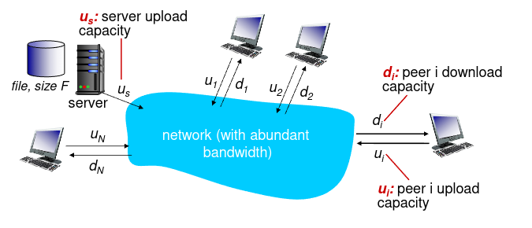
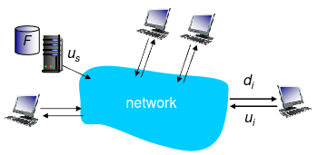
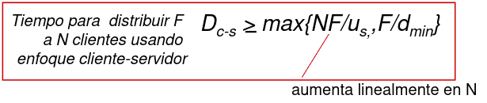
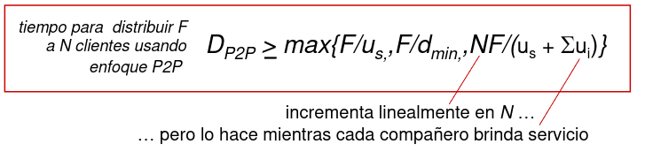

# Capa de Aplicacion de Internet

Existen dos enfoques para desarrollar aplicaciones de red para la internet:
1. El programador para especificar la comunicacion usa una **API**; una API es un conjunto basico de funciones. Para comunicar el software con la internet se usa la **Socket API**.
2. **La Web**: El programador se apoya en la tegnologia de la web para construir aplicaciones de red. La web provee servicios al software de la aplicacion que hacen mas facil a los desarrolladores implementar la comunicacion y la entrada/salida.

## Arquitectura de Aplicaciones

Las aplicaciones de red de internet suelen usar un **Estilo de Arquitectura**:
* **Cliente-Servidor**.
* ***Peer-to-Peer*** (**P2P**).
* **Arquitectura Orientada a Servicios**.
* **Microservicios**.

### Cliente-Servidor

En el modelo cliente-servidor existen dos procesos que se comunican entre si: uno en la maquina del cliente y otro en la maquina del servidor.

La forma en la que se comunica es:
1. El proceso **Manda una Solicitud** al proceso servidor.
2. El proceso cliente espera un **Mensaje de Respuesta**.
3. Luego el proceso servidor **Recibe y Procesa la Solicitud**.
4. El proceso servidor **Manda un Mensaje de Respuesta** al proceso cliente.

#### Caracteristicas de los servidores
* Siempre esta en un *Host*.
* Tienen direccion IP permanente.

#### Caracteristicas de los clientes
* Pueden esta conectados **Intermitentemente**.
* Usan direcciones IP dinamicas.
* Los clientes no se comunican directamente entre si.

#### Aplicaciones Cliente-Servidor en Internet Usando UDP

Los pasos de una aplicacion cliente-servidor en internet cuando usa el protocolo **UDP** (***User Datagram Protocol***) son los siguientes:
1. El cliente **Crea un Datagrama con IP** y **Puerto de Servidor**, y lo **Envia** (los datagramas pueden perderse). 
2. Si llegan, el servidor **Lee el Datagrama**.
3. El servidor **Envia una Respuesta** especificando direccion y puerto de cliente.
4. Si llega, el cliente **Lee el Datagrama**.
5. El cliente finaliza.

El problema que se puede ver usando el protocolo UDP es que no se dice que se hace si la respuesta no llega al cliente.

#### Aplicaciones Cliente-Servidor en Internet Usando TCP

Los pasos de una aplicacion cliente-servidor en internet cuando usa el protocolo **TCP** (***Transmission Control Protocol***) son los siguientes:
1. Se **Ejecuta** el proceso del servidor.
2. El servidor **Espera** por pedido de conexion entrante.
3. El cliente **Requiere** pedido de conexion al servidor.
4. El servidor **Acepta** la conexion con el cliente.
5. El cliente **Envia un Pedido** al servidor.
6. El servidor **Lee el Pedido**.
7. El servidor **Envia la Respuesta**.
8. El cliente **Lee la Respuesta**.
9. Si hay mas pedidos, entonces el cliente vuelve al paso 5.
10. El cliente **Cierra** la conexion.
11. El servidor **Cierra** la conexion.

#### Distribucion de Archivos

¿Cuanto tiempo se requiere para distribuir un archivo (de tamaño `F`) de un servidor a `N` compañeros?

¿Que parametros hay que considerar?
* Tasa de subida del enlace de acceso al compañero `i`: $u_{i}$.
* Tasa de subida del enlace de acceso al servidor: $u_{s}$.
* Tasa de descarga del enlace de acceso al compañero `i`: $d_{i}$.
* Tamaño del archivo a ser distribuido: $F$.
* Numero de compañeros que quieren adquirir una copia del archivo: $N$.

El **Tiempo de Distribucion** es el tiempo que toma obtener una copia del archivo por los `N` compañeros. Asumimos que la internet tiene abundante ancho de banda y todos los cuellos de botella suceden en ISP de acceso. Tambien asumimos que los servidores y clientes no participan de otra aplicaciones de red.

**Transmision del Servidor**: Debe enviar secuencialmente (subida) `N` copias de archivo a cada *peer* (manda `NF` bits).
* El tiempo para enviar 1 copia: $\frac{F}{u_{s}}$.
* El tiempo para enviar `N` copias: $\frac{NF}{u_{s}}$.

**Descarga del Cliente**: Cada cliente debe descargar una copia de archivo.
* $d_{min}$ = $min{d_{1},d_{2},\ldots,d_{N}}$.
* Tiempo de descarga del cliente con $d_{min}$: $\frac{F}{d_{min}}$ segundos.

### Arquitectura P2P

El modelo de arquitectura ***peer-to-peer*** (**P2P**) es una red descentralizada donde cada **Nodo** (***Peer***) funciona simultaneamente como cliente y servidor, compartiendo recursos, ancho de banda o almacenamiento directamente con otros sin un servidor central. Mientras mas haya mas nodos, mejor sera el funcionamiento ya que muchos comparten recursos con los que necesitan y no saturan la red.

#### Distribucion de Archivos

* Al comienzo solo el servidor tiene el archivo. 
* Para que la comunidad de compañeros reciba este archivo, el servidor debe enviar cada bit del archivo al menos una vez en su alcance de acceso.
* En P2P cada compañero puede redistribuir cualquier porcion del archivo que ha recibido a cualesquiera otros compañeros. Asi los compañeros asisten al servidor en el proceso de distribucion. Cuando un compañero recibe algo de datos de un archivo, puede usar su capacidad de subida para distribuir los datos a los otros compañeros.
* La **Capacidad Total de Subida** es:

$$u_{total} = \sum_{i=1}^{N} u_{i}$$

* Por lo tanto el **Tiempo Minimo de Distribucion** es:

$$\frac{F}{u_{total}}$$

**Transmision del Servidor**: Debe subir al menos una copia.
* El tiempo para enviar una copia: $\frac{F}{u_{s}}$.

**Cliente**: Cada cliente debe descargar la copia de un archivo.
* Tiempo minimo de descarga de cliente: $\frac{F}{d_{min}}$.

**Clientes**: Como agregado deben subir `NF` bits.
* La tasa de subida maxima (tasa maxima limitante de descarga) es $u_{s} + \sum_{i=1}^{N} u_{i}$.

### Arquitectura Orientada a Servicios

En esta arquitectura se requiere ciertos requisitos:

**Requisitos Funcionales**: Estos requisitos definen las capacidades básicas necesarias para que el sistema opere y cumpla su propósito.
* **Provision de Servicios**: Los servicios deben ser capaces de proporcionar funcionalidades especificas.
* **Consumo de Servicios**: Los clientes (o sea aplicaciones o usuarios) deben poder solicitar y recibir servicios.

**Requisitos No Funcionales**:Estos requisitos se refieren a las características de calidad, comportamiento y restricciones del sistema, las cuales son críticas para su viabilidad técnica y operativa.
* **Interoperabilidad** entre servicios: La comunicacion entre servicios de manera efectiva independientemente de la plataforma  o lenguaje de programacion usado.
* **Reusabilidad**: Los servicios deben diseñarse para reutilizarse en diferentes contextos.
* **Escalabilidad**: Los servicios deben escalar segun sea necesario.
* **Fiabilidad**: Los servicios deben ser capaces de adaptarse a cambios en las necesidades del negocio.
* **Seguridad**: Garantizar la seguridad de los datos y las transacciones entre servicios.

La arquitectura orientada a servicios (SOA) organiza las aplicaciones en **servicios Reutilizables**  que se comunican entre si a traves de un bus de servicios. 
* Cada servicio realiza una funcion especifica y puede ser usado por diferentes aplicaciones. 
* En SOA los servicios se comunican entre si usando patros como solicitud-respuesta, publicar-suscribir o enviar-olvidar. 
* Los servicios son modulares y pueden actuar tanto como cliente como servidores dependiendo del contexto.
* **Nodos** (roles):
    * **Servicios Independientes**: Cada servicio tiene un rol definido.
    * **Bus de Servicios Empresarial**(**ESB**): Infraestructura de software que facilita la integracion y comunicacion entre los servicios.
    * **Clientes**: Consumen los servicios ofrecidos.
* **Mensajes de Comunicacion**:
    * **Clientes a ESB**: Solicitudes de servicios, datos a procesar.
    * **ESB a Servicios**: Enrutamiento de solicitudes a los servicios adecuados.
    * **Servicios a ESB**: Respuesta a las solicitudes, datos procesados.
    * **Servicios Entre Si**: Comunicacion para coordinar acciones y compartir datos.

### Arquitectura de Microservicios

**Requisitos Funcionales**:
* **Provisión de Servicios Especializados**: proporcionar funciones únicas y bien definidas.
* **Comunicación Entre Servicios**: para cumplir con tareas más complejas.
* **Consumo de Servicios**: los clientes o aplicaciones deben poder solicitar y recibir servicios de manera eficiente.

**Requisitos No Funcionales**:
* **Escalabilidad**: escalamiento independiente de cada servicio según demanda.
* **Flexibilidad**: en el desarrollo y despliegue, los servicios deben adaptarse a los cambios en las necesidades del negocio.
* **Mantenibilidad**: fácil implementar nuevas funcionalidades.
* **Seguridad**: se pueden implementar políticas de seguridad más centralizadas y consistentes a través de los servicios. Garantizar la seguridad de los datos y las transacciones entre servicios.
* **Independencia y Autonomía**: cada servicio debe ser capaz de desarrollarse, implementarse y escalarse de manera independiente.
* **Resiliencia**: los servicios deben diseñarse para tolerar fallos y mantener la operación continua, incluso si uno de ellos falla.

La Arquitectura de Microservicios es una evolcion de la SOA (Service Oriented Architecture). 
* La aplicacion se divide en pequeños **Servicios Independientes** que se comunican entre si a traves de APIs que no dependen de un lenguaje especifico. Cada microservicio se especializa en una sola tarea y se encarga de una funcionalidad especifica. Un microservicio puede actuar tanto como cliente cmo servidor dependiendo del contexto y la tarea que se esta realizando.
* Usa  APIs REST, o gPRC para la comunicacion.
* **Nodos** (roles):
    * **Servicios Independientes**: Componentes funcionales que interactuan entre si.
    * **API Gateway**: Intermediario que gestiona las solicitudes entre clientes y microservicios.
    * **Clientes**: Aplicaciones que consumen servicios.
* **Mensajes de Comunicacion**:
    * **Clientes a API Gateway**: Solicitudes de datos, comandos.
    * **API Gateway a Microservicios**: Ruteo de solicitudes a los microservicios correspondientes.
    * **Microservicios a API Gateway**: Respuesta a las solicitudes, resultados de las operaciones.
    * **Microservicios entre si**: Comunicacion inter-servicios para operaciones complejas.
* **Protocolos**: Se suele usar SOAP o REST para la comunicacion entre servicios.

## Protocolos de Capa de Aplicacion

