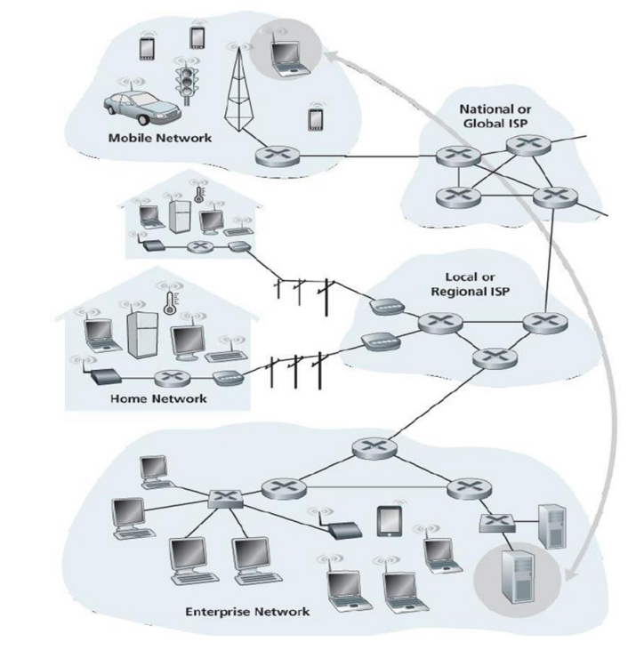
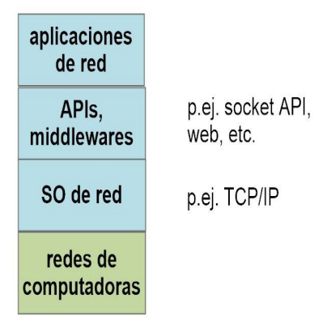

# Introducción a las Redes de Dispositivos (Parte 1)

### Redes de dispositivos

* Una **Red de dispositivos** es una estructura compuesta por dispositivos (o nodos) interconectados.

    - Dos nodos estan **Interconectados** si pueden intercambiar información.

    - Estos dispositivos pueden **Compartir** recursos como: Almacenamiento, aplicaciones, servicio. **Facilitando** la colaboración y el funcionamiento conjunto de los dispositivos conectados.

    - La **conexión** puede hacerse por **Medios de transmisión** que utilizan medios **físicos** (cables de cobre, fibra óptica) o **Inalámbrico** (microondas, bluetooth).

    - La **comunicación** entre los nodos **se realiza mediante Protocolos** espécificos que aseguran la correcta y eficiente transmisión de datos.

    - **Ejemplos de Dispositivos**:

        - Computadoras.

        - Celulares.

        - Impresoras.

        - Dispositivos IoT

        - etc ...

* Nos **enfocaremos** en los siguientes ejemplos de redes de dispositivos:

    - **La [Internet](#la-internet)**: conecta computadoras entre si por medio de **proveedores de servicio de internet**.

    - **La [Nube](#la-nube)**: Por medio de una **red de servidores** interconectados se **proveen servicios** a organizaciones o personas, como almacenamiento y ejecución de aplicaciones.

    - **La [Internet de las cosas](#la-internet-de-las-cosas)**: Dispositivos físicos llamados **dispositivos IoT** que se conectan a internet, comparten datos entre sí y con sistemas en la nube.

    - **La [Red Blockchain](#red-blockchain)**: Conjunto de nodos interconectados usados para **mantener y validar** un registro digital descentralizado de **transacciones**.

---

### La Internet

* La **internet**: red que cubre todo el globo y consiste de varias **redes de área local** (***LAN***) conectadas entre sí por medio de **proveedores de servicios de internet** (***PSI***). 

    - **LAN**: **red localizada** que conecta dispositivos dentro de un **área física** específica como:
    
        - Casas. 
        
        - Oficinas.
        
        - Escuelas.
        
        - etc...

    - Los **dispositivos en una LAN** incluyen: 
    
        - Computadoras.
        
        - Impresoras.
        
        - Celulares.

        - Televisores.
        
        - Conmutadores.
        
        - Puentes.
        
        - Y otros....

    - Los **Proveedores de servicio de internet** (**PSI**): **proveen los servicios e infraestructura** necesarios para que los usuarios **conecten sus LAN a la internet más amplia**. **Manejan el tráfico de datos** entre usuarios y la red global. **Usan** dispositivos como **enrutadores** y **puertas de enlace**. **Facilitan la conexión** a través de varios medios incluyendo:

        - Cable.
        
        - DSL.
        
        - Fibra óptica.
        
        - Y tecnologías inalámbricas.

- En internet hay **aplicaciones de red** que permiten:

    - **Compartir recursos**: Recursos de hardware (Impresoras, almacenamiento), compartir información (Datos, archivos.)

    - **La comunicación entre personas**; mail, chat, mensajería, teleconferencia, telefonía IP.

    - **Socializar**: para ello se usan redes sociales.

    - **Trabajo colaborativo**: creación de documentos entre varias personas.

    - **Comercio electrónico**.

    - **Entretenimiento**: Distribución de contenidos de TV por suscripción (IPTV), juegos.

Ejemplo de una **Red de Internet**.

* Para poder **aprovechar** y **gestionar** los distintos tipos de redes **se define el sistema operativo de red de la internet**. 

* En la internet para proveer servicios se crean **Aplicaciones de Red**.

    - Para programarlas se usan **APIs** como los **sockets** y **middlewares** como **la web** y **llamadas a procedimientos remotos**. Estos últimos se basan en el sistema operativo de red. El SO de red se apoya en el hardware de redes de computadoras (rectángulo verde) que forman las LAN y los ISP.

---

### La Nube

* La **nube**: **permite** el acceso remoto a un conjunto de **recursos informáticos** (almacenamiento, procesamiento de datos y aplicaciones), a través de una **red de servidores** interconectados.

    - Los **servidores** **utilizan** protocolos para comunicarse entre sí y con los usuarios, lo que **facilita** la entrega eficiente y escalable de servicios.

    - Los **recursos** se **asignan y usan** dinámicamente según las necesidades cambiantes de los servicios ofrecidos, **permitiendo** a las organizaciones optimizar su infraestructura tecnológica sin necesidad de gestionar físicamente el hardware.

- **Clasificaciones de las nubes**:

    - **Nube publica**: infraestructura compartida proporcionada por proveedores como AWS, Azure y Google Cloud. Los recursos son compartidos entre múltiples usuarios.

    - **Nube Privada**: Infraestructura dedicada a una sola organización, proporcionando mayor control y seguridad.

    - **Nube híbrida**: Combina nubes públicas y privadas, permitiendo a las organizaciones aprovechar lo mejor de ambos mundos.

---

### La Internet de las Cosas

* **La internet de las cosas** (***IoT***): Sistema interconectado que **permite** que dispositivos físicos , conocidos como **dispositivos IoT** se conecten a internet y compartan datos entre sí y con sistemas en la nube.

    - Se conectan a Internet a través de diferentes tecnologías como WiFi, Bluetooth, redes de celulares.

* **Ejemplos de dispositivos IoT**:

    - **Sensores**: Sensor de temperatura, sensor de humedad, sensor de movimiento, sensor de presión, sensor de luz, sensor de gas, sensor de aceleración.

    - **Actuadores**: Ejecutan acciones físicas basadas en señales eléctricas (actuadores para cerrar y abrir puertas, ventanas y persianas; actuadores para regular la temperatura de una habitación o dispositivo; interruptores controlados para prender o apagar dispositivos).

    - **Wearables**: Dispositivos portátiles que monitorean la salud y actividad física (pulseras de actividad que rastrean pasos y frecuencia cardíaca).

    - **Electrodomésticos Inteligentes**.

    - **Cámaras de seguridad interconectadas**.

* **Propósito de la IoT**: Crear una red de objetos conectados que recopilen, compartan y actúen con información para mejorar la vida cotidiana y la eficiencia.

* **Las metas de la IoT**:

    - **Automatización**.

    - **Monitoreo**.

    - **Optimización de recursos**.

    - **Mejora de la vida cotidiana**.

    - **Sostenibilidad ambiental**: reducir emisiones, reducir ruido.

    - **Análisis de datos**.

    - **Mejorar la seguridad física**.

---

### Red Blockchain

- Una **red blockchain**: Conjunto de nodos interconectados que **operan** en un sistema descentralizado que **permite** la creación de un registro digital de transacciones descentralizado y seguro. Tambien **permite** la validación del registro de transacciones, **usando** mecanismos de consenso para asegurar la integridad y seguridad de los datos.

    - Las transacciones se agrupan en **bloques que se encadenan** unos con otros. Esta cadena es accesible y verificable por participantes de la red.

    - Una red blockchain puede **proporcionar** funcionalidades avanzadas como **contratos inteligentes** que **automatizan procesos** mediante **condiciones predefinidas**.

* **Tipos de dispositivos en una red blockchain**:

    - **Nodos completos** que **tienen copias del registro** (también llamado **libro mayor**) y participan en la validación de transacciones y también pueden ejecutar contratos inteligentes.

    - Los **dispositivos mineros** se usan para validar transacciones y **crear nuevos bloques** en redes blockchain una vez que resolvieron un problema matemático complejo.

        - Los dispositivos mineros tienen también una copia completa de la blockchain.

        - Si la blockchain no tiene nodos mineros, los nodos completos pueden cumplir el rol de crear y agregar nuevos bloques a la blockchain pero usando otro mecanismo distinto de resolver un problema matemático.

    - **Nodos ligeros**: pueden **verificar y procesar transacciones**; solicitan datos a nodos completos para sus operaciones.

    - Las **billeteras digitales** son aplicaciones o dispositivos físicos que permiten a los usuarios almacenar, enviar y recibir criptomonedas, interactuando con la red blockchain.

* **Objetivos de las redes blockchain**:

    - **Transparencia**: Permitir a los usuarios verificar las transacciones en tiempo real, aumentando la confianza entre las partes involucradas.

    - **Inmutabilidad**: Garantizar que una vez que los datos son registrados, no puedan ser alterados ni eliminados sin el consenso de la red.

    - **Descentralización**: Eliminar la dependencia de un único punto de control, lo que reduce el riesgo de fraude y mejora la resiliencia del sistema.

    - **Interoperabilidad**: Facilitar la comunicación y el intercambio de datos entre diferentes blockchains, creando así un ecosistema más integrado.

* **La blockchain se basa en y se conecta con tecnologías anteriores como**:

    - **Internet**: Proporciona la infraestructura necesaria para la comunicación entre nodos distribuidos. La blockchain opera sobre Internet, utilizando sus protocolos para transmitir datos y permitir el acceso global.

    - **Nubes**: Aunque blockchain puede funcionar independientemente, a menudo se integra con servicios en la nube para almacenamiento adicional y procesamiento, mejorando su escalabilidad y flexibilidad.

    - **Bases de Datos**: A diferencia de las bases de datos tradicionales que son centralizadas, la blockchain actúa como una base de datos distribuida donde hay nodos que mantienen una copia del registro, lo que mejora la seguridad y la transparencia.

---