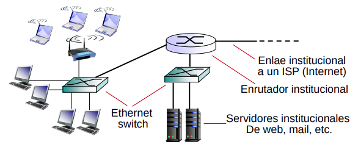

# Introducción a las Redes de Dispositivos (Parte 1)

## Redes de dispositivos

* Una **Red de dispositivos** es una estructura compuesta por dispositivos (o nodos) interconectados.

    - Dos nodos estan **Interconectados** si pueden intercambiar información.

    - Estos dispositivos pueden **Compartir** recursos como: Almacenamiento, aplicaciones, servicio. **Facilitando** la colaboración y el funcionamiento conjunto de los dispositivos conectados.

    - La **conexión** puede hacerse por **Medios de transmisión** que utilizan medios **físicos** (cables de cobre, fibra óptica) o **Inalámbrico** (microondas, bluetooth).

    - La **comunicación** entre los nodos **se realiza mediante Protocolos** espécificos que aseguran la correcta y eficiente transmisión de datos.

    - **Ejemplos de Dispositivos**:

        - Computadoras, Celulares, Impresoras, Dispositivos IoT, etc ...

* Nos **enfocaremos** en los siguientes ejemplos de redes de dispositivos:

    - **La [Internet](#la-internet)**: conecta computadoras entre si por medio de **proveedores de servicio de internet**.

    - **La [Nube](#la-nube)**: Por medio de una **red de servidores** interconectados se **proveen servicios** a organizaciones o personas, como almacenamiento y ejecución de aplicaciones.

    - **La [Internet de las cosas](#la-internet-de-las-cosas)**: Dispositivos físicos llamados **dispositivos IoT** que se conectan a internet, comparten datos entre sí y con sistemas en la nube.

    - **La [Red Blockchain](#red-blockchain)**: Conjunto de nodos interconectados usados para **mantener y validar** un registro digital descentralizado de **transacciones**.

---

## La Internet

* La **internet**: red que cubre todo el globo y consiste de varias **redes de área local** (***LAN***) conectadas entre sí por medio de **proveedores de servicios de internet** (***PSI***). 

    - **LAN**: **red localizada** que conecta dispositivos dentro de un **área física** específica como:
    
        - Casas, Oficinas, Escuelas, etc...

    - Los **dispositivos en una LAN** incluyen: 
    
        - Computadoras, Impresoras, Celulares, Televisores, Conmutadores, Puentes, Y otros....

    - Los **Proveedores de servicio de internet** (**PSI**): **proveen los servicios e infraestructura** necesarios para que los usuarios **conecten sus LAN a la internet más amplia**. **Manejan el tráfico de datos** entre usuarios y la red global. **Usan** dispositivos como **enrutadores** y **puertas de enlace**. **Facilitan la conexión** a través de varios medios incluyendo:

        - Cable, DSL, Fibra óptica, Y tecnologías inalámbricas.

- En internet hay **aplicaciones de red** que permiten:

    - **Compartir recursos**: Recursos de hardware (Impresoras, almacenamiento), compartir información (Datos, archivos.)

    - **La comunicación entre personas**; mail, chat, mensajería, teleconferencia, telefonía IP.

    - **Socializar**: para ello se usan redes sociales.

    - **Trabajo colaborativo**: creación de documentos entre varias personas.

    - **Comercio electrónico**.

    - **Entretenimiento**: Distribución de contenidos de TV por suscripción (IPTV), juegos.

Ejemplo de una **Red de Internet**. =>

* Para poder **aprovechar** y **gestionar** los distintos tipos de redes **se define el sistema operativo de red de la internet**. 

* Para proveer servicios en la internet se crea **Aplicaciones de Red**.

    - Para programarlas se usan **APIs** como los **sockets** y **middlewares** como **la web** y **llamadas a procedimientos remotos**. Estos últimos se basan en el sistema operativo de red. El SO de red se apoya en el hardware de redes de computadoras (rectángulo verde) que forman las LAN y los ISP.

---

## La Nube

* La **nube**: **permite** el acceso remoto a un conjunto de **recursos informáticos** (almacenamiento, procesamiento de datos y aplicaciones), a través de una **red de servidores** interconectados.

    - Los **servidores** **utilizan** protocolos para comunicarse entre sí y con los usuarios, lo que **facilita** la entrega eficiente y escalable de servicios.

    - Los **recursos** se **asignan y usan** dinámicamente según las necesidades cambiantes de los servicios ofrecidos, **permitiendo** a las organizaciones optimizar su infraestructura tecnológica sin necesidad de gestionar físicamente el hardware.

- **Clasificaciones de las nubes**:

    - **Nube publica**: infraestructura compartida proporcionada por proveedores como AWS, Azure y Google Cloud. Los recursos son compartidos entre múltiples usuarios.

    - **Nube Privada**: Infraestructura dedicada a una sola organización, proporcionando mayor control y seguridad.

    - **Nube híbrida**: Combina nubes públicas y privadas, permitiendo a las organizaciones aprovechar lo mejor de ambos mundos.

---

## La Internet de las Cosas (IoT)

* **La internet de las cosas** (***IoT***): Sistema interconectado que **permite** que dispositivos físicos , conocidos como **dispositivos IoT** se conecten a internet y compartan datos entre sí y con sistemas en la nube.

    - Se conectan a Internet a través de diferentes tecnologías como WiFi, Bluetooth, redes de celulares.

* **Ejemplos de dispositivos IoT**:

    - **Sensores**: Sensor de temperatura, sensor de humedad, sensor de movimiento, sensor de presión, sensor de luz, sensor de gas, sensor de aceleración.

    - **Actuadores**: Ejecutan acciones físicas basadas en señales eléctricas (actuadores para cerrar y abrir puertas, ventanas y persianas; actuadores para regular la temperatura de una habitación o dispositivo; interruptores controlados para prender o apagar dispositivos).

    - **Wearables**: Dispositivos portátiles que monitorean la salud y actividad física (pulseras de actividad que rastrean pasos y frecuencia cardíaca).

    - **Electrodomésticos Inteligentes**.

    - **Cámaras de seguridad interconectadas**.

* **Propósito de la IoT**: Crear una red de objetos conectados que recopilen, compartan y actúen con información para mejorar la vida cotidiana y la eficiencia.

* **Las metas de la IoT**:

    - **Automatización**, **Monitoreo**, **Optimización de recursos**, **Mejora de la vida cotidiana**, **Sostenibilidad ambiental** (reducir emisiones, reducir ruido), **Análisis de datos**, **Mejorar la seguridad física**.

---

## Red Blockchain

- Una **red blockchain**: Conjunto de nodos interconectados que **operan** en un sistema descentralizado que **permite** la creación de un registro digital de transacciones descentralizado y seguro. Tambien **permite** la validación del registro de transacciones, **usando** mecanismos de consenso para asegurar la integridad y seguridad de los datos.

    - Las transacciones se agrupan en **bloques que se encadenan** unos con otros. Esta cadena es accesible y verificable por participantes de la red.

    - Una red blockchain puede **proporcionar** funcionalidades avanzadas como **contratos inteligentes** que **automatizan procesos** mediante **condiciones predefinidas**.

* **Tipos de dispositivos en una red blockchain**:

    - **Nodos completos** que **tienen copias del registro** (también llamado **libro mayor**) y participan en la validación de transacciones y también pueden ejecutar contratos inteligentes.

    - Los **dispositivos mineros** se usan para validar transacciones y **crear nuevos bloques** en redes blockchain una vez que resolvieron un problema matemático complejo.

        - Los dispositivos mineros tienen también una copia completa de la blockchain.

        - Si la blockchain no tiene nodos mineros, los nodos completos pueden cumplir el rol de crear y agregar nuevos bloques a la blockchain pero usando otro mecanismo distinto de resolver un problema matemático.

    - **Nodos ligeros**: pueden **verificar y procesar transacciones**; solicitan datos a nodos completos para sus operaciones.

    - Las **billeteras digitales** son aplicaciones o dispositivos físicos que permiten a los usuarios almacenar, enviar y recibir criptomonedas, interactuando con la red blockchain.

* **Objetivos de las redes blockchain**:

    - **Transparencia**: Permitir a los usuarios verificar las transacciones en tiempo real, aumentando la confianza entre las partes involucradas.

    - **Inmutabilidad**: Garantizar que una vez que los datos son registrados, no puedan ser alterados ni eliminados sin el consenso de la red.

    - **Descentralización**: Eliminar la dependencia de un único punto de control, lo que reduce el riesgo de fraude y mejora la resiliencia del sistema.

    - **Interoperabilidad**: Facilitar la comunicación y el intercambio de datos entre diferentes blockchains, creando así un ecosistema más integrado.

* **La blockchain se basa en y se conecta con tecnologías anteriores como**:

    - **Internet**: Proporciona la infraestructura necesaria para la comunicación entre nodos distribuidos. La blockchain opera sobre Internet, utilizando sus protocolos para transmitir datos y permitir el acceso global.

    - **Nubes**: Aunque blockchain puede funcionar independientemente, a menudo se integra con servicios en la nube para almacenamiento adicional y procesamiento, mejorando su escalabilidad y flexibilidad.

    - **Bases de Datos**: A diferencia de las bases de datos tradicionales que son centralizadas, la blockchain actúa como una base de datos distribuida donde hay nodos que mantienen una copia del registro, lo que mejora la seguridad y la transparencia.

---

## Estructura de la Internet

* Formada por billones de dispositivos de computación conectados entre sí.

* Se ejecutan **aplicaciones de red**.

* Red de redes que interconecta varias redes entre sí.

* Para envío y recepción de mensajes entre computadoras se usan protocolos.

* Hosts acceden a la internet a través de **proveedores de servicios de internet de acceso** (***ISPs de acceso***).

* **Tipos de ISP de acceso**:

    - Uso de **ISP residenciales**: compañías de cable, telefónicas, fibra a la casa (FTTH), etc.

    - Uso de **ISP empresarial**: da acceso a sus empleados.

    - Uso de **ISPs universitaria**: da acceso a docentes, estudiantes y personal.

    - **ISPs que proveen acceso a WiFI**: aeropuertos, hoteles, restaurantes, etc.

* **¿Cómo hacer para que dos hosts que están conectados a diferentes ISPs de acceso puedan enviarse paquetes entre sí?** ISPs de acceso deben estar interconectados.

**Problema**: Dados miles de ISP de acceso, ¿cómo conectarlos entre sí?

**Idea**: conectar cada ISP de acceso a todo otro ISP de acceso. Esto se conoce como una **Malla**.

**Idea 2**: ¿Conectar cada ISP de acceso a un ISP global de tránsito? Las **ISP cliente** y **provedora** tienen acuerdo económico

**Idea 3**: Es más conveniente tener ISPs globales de tránsito que conectan los ISP de acceso. **¿Por qué es más conveniente?**

* Las ISP de acceso son interconectadas a través de redes ISP nacionales e internacionales de más alto nivel llamados **ISPs de capa superior** o **globales de tránsito**.

    - Estas son ISP que proveen **servicios de tránsito** (pueden **competir entre si**).

    - Una ISP de capa superior consiste de **enrutadores de alta velocidad** interconectados con **enlaces de fibra óptica** de alta velocidad.

* **Conclusiones del Grafico**:

    - Las ISP globales de tránsito deben estar interconectadas entre sí.

    - Cada red ISP, ya sea de acceso o de capa superior, es manejada independientemente.

**Problema**: Los ISP globales de tránsito no tienen presencia en cada ciudad o región del mundo. ¿Y esto qué implica? => Hay ISPs de acceso que no se pueden conectar a ISP globales.

**Solución**: en una región puede haber un **ISP regional** al cual se conectan los ISP de acceso en la región.

* **Consecuencias de la Solución**:

    - Luego cada ISP regional se conecta con ISPs globales de tránsito.

    - Los ISP de acceso pagan al ISP regional al cual se conectan, y cada ISP regional paga al ISP global de tránsito al cual se conecta.

    - En algunos lugares un ISP regional puede cubrir un país entero y a ese ISP regional se conectan otros ISP regionales.

* Finalmente tenemos las redes proveedoras de contenido (por ejemplo, Google, Facebook, Microsoft, Apple, etc...).

* **Estas redes se usan para**:

    - Reducir pagos a redes de tránsito global.

    - Tener control sobre cómo sus servicios son entregados a los usuarios finales.

* **Las redes proveedoras de contenido se conectan a**:

    - A ISP regionales e ISP de acceso.

    - Podrían llegar a usar un ISP de tránsito si no lequeda otra.

y redes proveedoras de contenido (e.g., Google, Microsoft, Akamai) pueden ejecutar su propia red, para traer servicios, y contenido cerca de los usuarios.

* **“tier-1” ISPs comerciales**: (redes globales de tránsito), cobertura
nacional e internacional.

* Redes proveedoras de contenido

* En el medio ISP regionales.

* Finalmente ISPs de acceso

* Otra forma de ver la estructura de la internet es como un conjunto de redes de distintos tamaños interconectadas entre sí:

    - Así las redes pueden venir en diferentes tamaños, formas y cumplir distintos propósitos.

    - Varias redes pueden interconectarse entre sí para formar redes más grandes.

    - La internet es el ejemplo de red de redes más grande.

---

## Tipos de redes

### Redes de área amplia (WANs)

* Una **Red de área amplia** (*WANs*) cubre un área geofráfica grande (un país o hasta un continente).

**Una WAN está organizada**:

* **Subred**: Varios **Enrutadores** conectados entre sí formando un grafo.

    - Un arco representa cable que une 2 enrutadores.

* A una subred pueden estar conectadas a computadoras o LAN enteras.

* Para ir de una máquina a otra hay distintas **Rutas alternativas**.

* Una red de área amplia va a permitir interconectar varias redes hogareñas e institucionales (llamadas **redes de área local** - **LAN**).

* ¿Como se hace para enviar mensajes en una WAN? ---> **Algoritmo de almacenamiento y reenvío**

    - Un paquete sigue una ruta de enrutadores.

    - El paquete se almacena enteramente en cada enrutador de la ruta.

    - El paquete almacenado en un enrutador espera allí hasta que la línea requerida de salida esté libre y luego se reenvía al siguiente enrutador.

* Toma $\frac{L}{R}$ segundos transmitir paquete de `L-bit` en un enlace de `R bps` (bps = Bits Por Segundos, Mbps = MegaBits Por Segundos)

Por ejemplo:

* $L = 7.5$ Mbits.

* $R = 1.5$ Mbits.

* Demora de transmision en un salto = 5 sec.

**Encolado y pérdida de paquetes**

* Si la tasa de llegada al enlace (en bits) excede la tasa de transmisión del enlace por un periodo de tiempo.

* ¿Que va a suceder?

    - Los paquetes se van a encolar, y esperaran a ser transmitidos en el enlace.

    - Los paquetes pueden ser descartados (perdidos) si la memoria (el búfer) se llena.

* **algoritmo de enrutamiento**

    - En general hay varios caminos que conectan dos enrutadores. El algoritmo de enrutamiento decide cuál de ellos usar.

**¿Cuanta demora el almacenamiento y reenvio?**

$d_{nodal} = d_{proc} + d_{queue} + d_{trans} + d_{prop}$

* $d_{proc}$: **Procesamiento del nodo**

    - Chequeo de errores.

    - Determinar la linea de salida.

    - typically < msec.

* $d_{queue}$: **Demora por encolado**

    - Tiempo de espera en el enlace de salida para transmision.

    - Depende de cuan congestionado esta el enrutador.

**Sistemas Telefónico fijo**

* Cada domicilio está conectado por un cable de cobre a una **End office** (Oficina central)

* Toda oficina central esta conectada a una **Toll office**

* **Toll offices** son usadas para reenvios de mensajes. Estan unidas por cables (de fibra optica).

### DSL

* Se usa una **Linea** telefonica a la oficina central **DSLAM**
    
    - Los datos sobre la linea DSL van a la internet.

    - La voz sobre la linea DSL va a la red telefonica.

* `< 2.5 Mbps` para subida de datos (typically `< 1 Mbps`).

* `< 24 Mbps` para bajada de datos (typically `< 10 Mbps`). 

**Ejemplos de Redes de area amplia**

* Arquitectura de red celular:

* Sistema de Fibra a la casa:

    - **Divisor optico** (*optical splitter*) para subdividir un cable de fibra optica en varios (cada uno va a una casa), usualmente menos de 100.

    - Cada casa tiene un **Terminador de red optica** (*optical network terminator* - *ONT*) para convertir entre señales opticas y electricas.

    - Tasas de transferencia de 100 Mbps o 300 Mbps.

### Redes de area Metropolitana (MAN)

* Una **Red de area metropolitana** (**MAN**) Cubre una ciudad.

* Existen **2 tipos**:

    1) **Redes de cable**: Se basan en la red de TV por cable.

    2) **WiMAX**: Son redes inalambricas de alta velocidad.

* MAN basadas en TV por cable

    - Cable coaxial sirve unir varias casas.

    - Elementos de communtacion son para comunicar viviendas en distintos cables coaxiales.

    - Elementos de communtacion se une por cables de fibra optica.

### Access net: cable network

* **El servicio es asimetrico**: Hasta 30 Mbps de bajada de datos, hasta 2 Mbps de subida de datos

    - **Uso de cable modem**..

* Divisor entre TV y cable modem.

* En una red de cable se conectan las casas a un proveedor de servicios de internet.

    - Las casas comparten el acceso a un **Cable Headend** para ello.

**Ejemplos**

MAN Wimax (estandar 802.16)

* Hay estacion base que permite enviar paquetes por el aire en lugar de usar cable o redes telefonicas.

* La estacion base se conecta a internet.

* Se puede acceder a la red Wimax desde computadoras en casas o edificios, o desde vehiculos en movimiento.

### Redes de Area local

* **Red de area local** (*LAN*): es una red operada privadamente dentro de un edificio o casa (Tambien puede operar en un campues de varios edificios).

* ¿Donde puede usarse una LAN?

    - En un **Hogar** o en una organizacion (publica o privada)

    - Por compañias se llaman **Redes empresariales**

* ¿Que tipos de hosts se comunican a una LAN?

    - Las LAN se usan para comunicar Aparatos electronicos.

    - La idea es que los hosts puedan compartir recursos e intercambiar informacion.

Existen **dos tipos de LAN**:

1) **LAN inalambrica**

2) **La Ethernet**

* **Difusion**:  Si una maquina envia un mensaje, todas las demas lo reciben.

* ¿A quien puede estar destinado un mensaje cuando se usa difusion?
t
    - A una unica maquina.

    - Ser enviado a todas las maquinas (***broadcasting***)

    - Ser enviado a un grupo de maquinas en particular (***multicasting***)

* ¿Porque puede pasar una situacion indeseable? (enviar un mensaje en una red de difusion y se pierde)

    - Por la **Colision**: Mas de una maquina manda simultaneamente un mensaje.

* ¿Que se hace en relacion a las colisiones? 

    - Evitar o minimizar, detecar y tratar las colisiones

### Red hogareñas

### Red de accesos empresarial

* Tasas de transmision de 10 Mbps, 100 Mbps, 1Gbps, 10 Gbps.

---

## Internet

* Red dorsales (***backbone***) estan conectadas a varias WAN.

* Redes metropolitanas pueden conectarse a WANs

* LANs estan conectadas a WANs o a redes metropolitanas.

---

## Estructura de la Nube

* Una nube es una red jerarquica compuesta por 4 niveles:

    1) **Regiones**: Ubicaciones geograficas donde los proveedores de servicios en la nube tienen centro de datos.

        - Cada region puede albergar multiples zonas de disponibilidad.

    2) **Zonas de disponibilidad**: Son **Centros de datos aislados** dentro de una region que estan diseñados para operar independientemente.

        - Proporcionan redundancia y alta disponibilidad, si una zona falla, las aplicaciones pueden seguir funcionando en otra.

    3) **Nube privada virtual** (**VPC**): Red virtual logicamente aislada dentro de una nube publica que permite a los usuarios definir su propio enterno de red.

        - Dentro se pueden crear subredes (publicas y privadas), lo que permite un control granular sobre el acceso a los resultados.

        - Abarca multiples zonas de disponibilidad proporsionando alta disponibilidad y tolerancia a fallos.

    4) **Subredes**: Divisiones dentro de una VPC que permiten organizar y aislar los recursos.

        - Pueden ser publicas (con acceso a internet), o privadas (sin internet). Facilita la gestion del trafico y la seguridad.

* **Tipos de Nodos en una nube**:

    - **Servidores web**: manejan las solicitudes HTTP/HTTPS y sirven contenido web.

    - **Servidores de aplicaciones**: Procesan la lógica de la aplicación y acceden a la base de datos.

    - **Servidores de bases de datos**: maneja las bases de datos (por ejemplo relacional).

    - **Almacenamiento de objetos**: utilizado para almacenar archivos estáticos como imágenes, videos y archivos de configuración.

    - **Balanceadores de carga**: distribuyen el tráfico entre múltiples servidores para optimizar el uso de los recursos y mejorar la disponibilidad.

        * Esto es escencial para menejar picos de trafico y garantizar tiempos de respuesta rapidos.

* **Clasificacion de los balanceadores de carga**:

    - **Balanceador de carta externo**: Se usa para distribuir tráfico de clientes externos hacia los servidores web (los usuarios externos envían solicitudes al balanceador de carga).

    - **Balanceador de carga interno**: se usa para distribuir el tráfico entre servidores internos, como entre servidores web y servidores de aplicaciones o bases de datos, sin exponer estos recursos al público. Solo está accesible desde una VPC.

* **Tipos de enrutadores en la nube**:

    - **Enrutador de la VPC**: se encarga de la comunicación entre las subredes dentro de la misma VPC y de dirigir el tráfico hacia y desde internet (a través de puerta de enlace de internet) o hacia otras VPCs (a través de puerta enlace de VPCs).

        * Los servidores en diferentes subredes dentro de la misma VPC se comunican a través del enrutador de la VPC.

        * Cuando un servidor en una subred publica necesita comunicarse con internet, el enrutador de la VPC dirige el trafico hacia la puerta de enlace de Internet.

        * Si necesitas que dos VPC se comuniquen entre si, usas una puerta de enlace de VPC.

    - **Puerta de enlace de internet**: se conecta a la internet y permite que los servidores en las subredes publicas envíen y reciban trafico de internet.

    - **Puerta de enlace de VPCs**: se usan para comunicar diferentes VPCs entre si.

---

## Estructura de la IoT

* Las redes IoT se pueden clasificar según diferentes criterios:

    1) Por tipo de **conectividad**:

        - **Redes de celulares**: usan tecnologías como **4G** y **5G** para proporcionar alta velocidad y cobertura amplia.

            * Son ideales para aplicaciones que requieren gran ancho de banda y baja latencia como videovigilancia y vehículos autónomos.

        - **Redes de medio alcance**: como WiFi.

        - **Redes de corto alcance**: incluyen tecnologías como **Bluetooth** y **Zigbee**, que son adecuadas para entornos pequeños como hogares y oficinas.
            
            * Tienen un alcance limitado, pero son eficientes en consumo energético.

        - **Redes de área amplia de baja potencia** (***LPWAN***): estas redes están diseñadas para dispositivos que requieren largas distancias de comunicación con bajo consumo energético.

            * Por ejemplo: recopilación de datos de medidores de energía, agua y gas; monitoreo agrícola a partir de sensores; seguimiento de vehículos en el transporte.

    2) Por **propósito o aplicación**:

        - **Redes de salud**: se usan en aplicaciones de telemedicina y **monitoreo de pacientes**, permitiendo la recopilación y transmisión de datos médicos en tiempo real. Suelen usar **dispositivos wearables** que envían datos a profesionales médicos.

        - **Redes industriales**: diseñadas para el **monitoreo y control** de maquinaria en fábricas. Usan redes celulares o Ethernet industrial.

        - **Redes de agricultura inteligente**: Usadas para la **monitorización** de cultivos y ganado, aprovechando la tecnología LPWAN. Suelen usar sensores para recopilar datos.

        - **Redes de hogar inteligente**: integran **dispositivos domésticos** conectados como termostatos, cámaras de seguridad. Usan Zigbee o Zwave.

        - **Redes para ciudades inteligentes**: usadas para **gestionar servicios urbanos** como el tráfico, la iluminación pública y la gestión de residuos. Suelen usar sensores para recolectar datos. Pueden incluir redes de celulares o LPWAN.

        - **Redes de transporte y logística**: se usan para **optimizar el transporte y la gestión de la cadena de suministro**. Por ejemplo: seguimiento de vehículos y flotas, monitoreo de condiciones de carga, sistemas de gestión de almacenes.

        - **Redes IoT de retail**: se usan para mejorar la experiencia del cliente y la eficiencia operativa en el comercio minorista. Por ejemplo: beacons para marketing de proximidad, sistemas de inventario inteligentes, análisis de comportamiento de clientes.

    3) Por **consumo energético**:

        - **Bajo consumo**: redes que priorizan la eficiencia energética, como:
            
            * **Zigbee**: usada en automatización del hogar.

            * **LoRaWAN**: usada en agricultura y ciudades inteligentes; son ideales para dispositivos que funcionan con baterías durante largos períodos, 
            
            * **Bluetooth**: usado en wearables y dispositivos médicos portátiles. 
            
            * **Sigfox**: para transmitir pequeñas cantidades de datos con cobertura extensa, Por Ejemplo: Usadas para rastreo de vehículos y sistemas de alerta de desastres naturales.
        - **Muy bajo consumo**: como **RFID** (para rastrear ubicación y movimiento de productos en tiendas; para permitir acceso a áreas restringidas en edificios de oficinas, para rastreo de ganado) y **NFC** (para pagos móviles, compartir información entre celulares, llaves electrónicas, usados en productos o tarjetas personales para proporcionar información).

        - **Alto consumo**: Redes que pueden soportar dispositivos con mayor demanda energética. Suelen usar WiFi o redes de celulares Ejemplos:
        
            * **Cámaras de seguridad** conectadas a WiFi.
            
            * Los **sistemas de monitoreo y control de maquinaria pesada o procesos de fabricación** avanzados pueden consumir mucha energía debido a la necesidad de mantener comunicaciones constantes y procesar grandes volúmenes de datos.
            
            * **Automóviles conectados y autónomos**, porque generan y procesan grandes cantidades de datos en tiempo real lo que lleva a un alto consumo energético.

* Las redes clasificadas según su propósito y aplicación pueden ser **redes de sensores** o **sistemas ciberfísicos** (CPS).

---

## Redes IoT de Sensores

* Una **red IoT de sensores** generalmente incluye diversos dispositivos de monitoreo y comunicación diseñados para recopilar, procesar y transmitir datos.

* Una red IoT de sensores suele incluir los siguientes tipos de
dispositivos:
    
    - **Sensores**: son dispositivos que recopilan datos específicos (p.ej: temperatura, humedad, movimiento, presión, etc.).
    
    - **Gateways IoT**: son dispositivos que actúan como intermediarios entre los sensores y la nube, recopilando y transmitiendo datos.
    
    - **Servidores en la nube**: almacenamiento y procesamiento de datos, análisis y ejecución de algoritmos.
    
    - **Dispositivos de usuario**: celulares, tablets o computadoras usadas para monitorear y controlar la red de sensores.

* **Conectores entre dispositivos**:

    - **Sensores a Gateways IoT**: usualmente conectados mediante redes inalámbricas de corto o medio alcance (Zigbee, Bluetooth, WiFi) o redes de baja potencia y largo alcance (LoRaWAN, NB-IoT).
    
    - **Gateways IoT a servidores en la nube**: conectados a través de internet usando TCP/IP, generalmente mediante WiFi, Ethernet o redes de celulares.
    
    - **Servidores en la nube a dispositivos de usuario**: conexión a través de internet usando TCP/IP, permitiendo el acceso remoto a los datos desde cualquier lugar.

---

## Sistemas CPS (*Cyber-Physical Systems*)

* Los **sistemas CPS** son sistemas que integran componentes físicos y computacionales.

    - Estos sistemas están diseñados para interactuar con el mundo físico a través de **sensores y actuadores** y están controlados por algoritmos computacionales.
    
    - **Características**:
    
        * Capacidad para interactuar y controlar procesos físicos.

        * Alta fiabilidad y seguridad.

        * Procesamiento distribuido y en tiempo real.

* **Dispositivos involucrados en un CPS**:

    - **Sensores**: recopilan datos del entorno físico.
    
    - **Actuadores**: dispositivos que realizan acciones basadas en los datos (p.ej. Válvulas, motores, luces, calentadores, etc.)
    
    - **Controladores**: dispositivos que procesan los datos de los sensores y envían comandos a los actuadores (p.ej: PLC, mocrocontroladores). El controlador actúa como el cerebro del sistema.

    - **Servidores en la nube**: almacenamiento y procesamiento de datos.

    - **Dispositivos de usuario**: computadoras, celulares y tablets que se usan para monitorear y controlar el sistema.

* **Conexiones entre dispositivos**:

    - **Sensores a controladores**: conexión por cables o inalámbrica (Zigbee, Wi-Fi)

    - **Controladores a actuadores**: conexión por cables o inalámbrica.

    - **Controladores a servidores en la nube**: conexión por Ethernet o redes de celulares.

    - **Conexión entre servidores en la nube y dispositivos de usuario**.

* **Escenario típico en sistemas CPS**:

    1. Sensores recopilan datos del entorno y envían esos datos a los controladores.

    2. Los controladores procesan los datos y determinan la acción a realizar.

    3. Los controladores envían comandos a los actuadores.

    4. Los controladores transmiten los datos y las acciones realizadas a los servidores en la nube para almacenamiento y análisis.

        - Se pueden usar aquí Gateways IoT como intermediarios.
    
    5. Los dispositivos de usuario permiten a los operadores monitorear y controlar el sistema en tiempo real mediante una conexión a internet.

        - Los dispositivos de usuario pueden monitorear el estado del sistema y enviar
comandos a los controladores y actuadores a través de la nube. 

* **Funciones de un controlador**:

    - **Recopilación y procesamiento de datos** provenientes de sensores.

    - **Control y ejecución de acciones**: basados en los datos de sensores y las condiciones programadas, el controlador envía comandos a los actuadores para realizar acciones específicas.

        * Los actuadores pueden confirmar de que las acciones solicitadas han sido ejecutadas correctamente.

        * Los controladores pueden mandar secuencias de control para operaciones automatizadas, como movimiento de robots industriales.

    - **Monitoreo y supervisión**: mantiene un monitoreo constante del estado de los dispositivos conectados incluyendo sensores y actuadores.

        * Puede recibir instrucciones desde paneles de control para ajustar parámetros de operación.

        * Puede recibir comandos desde sistemas de monitoreo remoto para iniciar, detener o modificar procesos.
        
        * Los actuadores pueden informar sobre su estado actual.

    - **Comunicación y coordinación**: facilita la comunicación entre diferentes dispositivos y sistemas en la red, actuando como intermediario para la transmisión de datos. Se coordina con Gateways IoT y servidores en la nube para el análisis y almacenamiento de datos.

    - **Gestión de alarmas y eventos**: detecta condiciones anómalas o situaciones de fallo y genera alarmas para notificar al personal de mantenimiento o a los sistemas de supervisión. Registra eventosimportantes para el diagnóstico y el análisis posterior.

    - **Retroalimentación a Gateways y sistemas en la nube**: transmite datos recopilados y procesados a los servidores en la nube para análisis adicional y almacenamiento. Puede sincronizar datos con otros sistemas de control y monitoreo remoto.

---

## Estructura de las redes blockchain

* **Características estructurales de la blockchain**:

    - **Estructura descentralizada**: no hay un nodo central que controle la red; hay varios nodos con copias del libro mayor que participan en proceso de validación de transacciones.

    - **Uso de modelo P2P**: cada nodo se conecta directamente a otros nodos sin intermediarios; hay una comunicación directa y eficiente entre los participantes.

    - **Consenso distribuido**: la red usa mecanismos de consenso para validar transacciones y mantener la integridad del libro mayor.

        * Todos los nodos deben llegar a un acuerdo sobre el estado de la blockchain antes de agregar nuevos bloques.

* **Tipos de nodos en una red blockchain**:

    - **Nodos completos**: Mantienen una copia completa del libro mayor de la blockchain. Son esenciales para la estabilidad y seguridad de la red, ya que validan todas las transacciones y bloques.

    - **Nodos ligeros**: No almacenan toda la blockchain, sino solo partes necesarias para verificar transacciones. Son ideales para dispositivos con recursos limitados, como celulares.

    - **Creadores de bloques**: participan en el proceso de minería; resolviendo problemas matemáticos complejos para añadir nuevos bloques a la blockchain y recibir recompensas en criptomonedas.

    - **Nodos de usuario**: representan los usuarios finales de la red blockchain; participando en transacciones y validaciones según sus permisos y roles.

    - **Nodos validadores**: verifican y validan transacciones y bloques, asegurando que se sigan las reglas de la red.

    - **Billeteras**: son nodos que almacenan claves privadas y públicas necesarias para realizar transacciones en la blockchain. Permiten a los usuarios enviar y recibir criptomonedas.
    
    - **Autoridades de certificación**: nodos que emiten y gestionan certificados digitales, asegurando la autenticidad y seguridad de las comunicaciones y transacciones en la red.

    - **Nodos que ejecutan contratos inteligentes**: ejecutan el código de los contratos inteligentes, permitiendo la automatización de acuerdos y transacciones sin intervención humana.

    - **Gateways**: actúan como puertas de entrada entre la blockchain y otros sistemas, facilitando la transferencia de datos y transacciones.

    - **Masternodes**: en algunas redes (p.ej: Dash) los masternodes tienen funciones adicionales como la ejecución de transacciones anónimas y la gestión de la red.

    - **Super nodos**: son nodos con mayor capacidad y recursos que ayudan a mejorar la eficiencia y velocidad de la red. Pueden comunicarse a muchos otros nodos y facilitar la distribución de datos. P.ej: pueden retransmitir transacciones y bloques. También pueden tener su copia de la blockchain.

    - **Nodos balanceadores de carga**: Distribuyen la carga de trabajo entre diferentes nodos para mejorar la eficiencia y rendimiento de la red.

* **Ejemplos de redes blockchain con sus tipos de nodos**:

    - **Bitcoin**: nodos completos, nodos mineros, nodos ligeros, super nodos.

    - **Ethereum**: nodos completos (además ejecutan contratos inteligentes), nodos ligeros, nodos mineros, balanceadores de carga.

    - **Ripple**: nodos validadores, nodos Gateway, nodos usuario.

    - **Hyperledger fabric**: nodos peer (con completos y ejecutan contratos inteligentes), nodos servicio de ordenamiento (ordenan transacciones y crean bloques que se distribuyen a los nodos peer), autoridades de certificación.

* Para cada red blockchain existe la **comunicación entre nodos** de distintos tipos.

    - Pero eso requiere estudiar cada red blockchain en particular.

    - De hecho hay que estudiar diferentes **casos de uso** de la red como una secuencia de mensajes entre nodos de la red.

    - Cuando estudiemos redes puntuales veremos ejemplos de comunicación dentro de ellas.

* Las redes blockchain individuales tienen ciertos problemas.
    
    - Veremos a continuación dos de los mismos y ejemplos de su solución.

---

## Interconexion de redes blockchain

* **Problema**: Crear aplicaciones descentralizadas (dApps) que interactúan con varias blockchain. Las mismas son necesarias por varias razones importantes:

    - **Permitir la comunicación y transferencia de datos y valor entre diferentes blockchain**. Se facilita así el uso de múltiples servicios y aplicaciones.

    - **Se pueden usar varias blockchains para almacenar datos y realizar transacciones**. Así se incrementa la seguridad y redundancia. Si una blockchain falla, los datos y transacciones están seguros en otra.

    - **Permite distribuir la carga de trabajo y transacciones entre diferentes blockchain**. Se reduce la congestión en una sola blockchain y las aplicaciones pueden ser más rápidas y eficientes.

    - **Aprovechan las características únicas de diferentes blockchain**.

    - **Optimización de costos**: eligen la blockchain más eficiente y económica para cada transacción.

* Existen distintos enfoques para manejar más de una red blockchain; p.ej: Cosmos y Polkadot.
    
    - Veremos brevemente el primero, que es el más simple.

* **Cosmos** (**la internet de blockchains**): es una plataforma diseñada para interconectar blockchains de manera eficiente y segura.

    - Para esto usa el protocolo de comunicación interblockchain (IBC).

    - Esto permite crear aplicaciones descentralizadas que pueden interactuar con varias blockchain (p.ej.: Bitcoin, Ethereum, Solana, etc.).

    - Cada blockchain en Cosmos es independiente y diferente; se las denomina como zonas.

    - Hay nodos centrales (hub) que conectan varias zonas y facilitan la conexión entre ellas.

    - Hay nodos clientes que usan la red para enviar y recibir transacciones, consultar datos y ejecutar contratos inteligentes.

    - Hay nodos validadores: participan en el consenso, validan transacciones. Estos nodos se comunican con los nodos hub.

---

## Integracion de datos externos con una blockchain

* **Problema**: Se necesita integrar datos externos con una blockchain porque los contratos inteligentes necesitan datos del mundo real para ejecutar ciertas funciones; pero los blockchain no pueden acceder directamente a estos datos.

* **Solución**: ChainLink que conecta datos externos con contratos inteligentes en diversas blockchain (p.ej: datos de sensores, precios de acciones, datos meteorológicos, etc.).

    - Usa oráculos que son nodos que recopilan datos de fuentes externas y los envían a la blockchain.

* **Distintos tipos de oráculos en ChainLink**:

    - **Oráculos de datos**: recopilan datos de fuentes externas.

    - **Oráculos de computación**: realizan cálculos complejos que no pueden ser procesados directamente por los contratos inteligentes en la blockchain.

    - **Oráculos de eventos**: proporcionan información sobre eventos específicos que ocurren fuera de la blockchain como la finalización de un contrato o laconfirmación de una entrega.

    - **Oráculos de procesamiento de pagos**: facilitan la transferencia de valor entre diferentes sistemas, permitiendo pagos entre contratos inteligentes y sistemas externos. P.ej: un oráculo que procesa un pago de una criptomoneda a un proveedor de servicios.