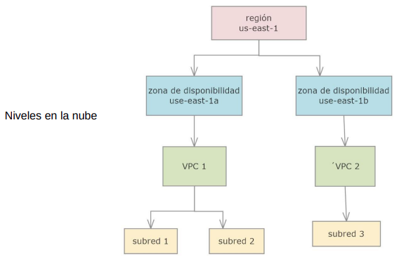

## Indice

### [Introduccion](#introduccion)
- [Introduccion](#introduccion-1)
  - [Redes de Dispositivos](#redes-de-dispositivos)
  - [La **Internet**](#la-internet)
    - [Aplicaciones de Red](#aplicaciones-de-red)
    - [Estructura de la Internet](#estructura-de-la-internet)
      - [Tipos de ISPs de Acceso](#tipos-de-isps-de-acceso)
      - [¿Como conectar diferentes ISPs entre si?](#como-conectar-diferentes-isps-entre-si)
      - [Problema de los ISP globales](#problema-de-los-isp-globales)
      - [Redes Proveedoras de Contenido](#redes-proveedoras-de-contenido)
      - [Jerarquia de la Internet](#jerarquia-de-la-internet)
  - [La **Nube**](#la-nube)
    - [Clasificacion de las Nubes](#clasificacion-de-las-nubes)
    - [Estructura de la Nube](#estructura-de-la-nube)
    - [Nodos](#nodos)
      - [Balanceadores de Carga](#balanceadores-de-carga)
    - [Enrutadores](#enrutadores)
  - [La **Internet de las Cosas** (***Internet of Things***) (IoT)](#la-internet-de-las-cosas-internet-of-things-iot)
      - [Ejemplos de Dispositivos IoT](#ejemplos-de-dispositivos-iot)
    - [Metas de la IoT](#metas-de-la-iot)
    - [Estructura de la IoT](#estructura-de-la-iot)
      - [Por Tipo de Conectividad](#por-tipo-de-conectividad)
      - [Por Proposito o Aplicacion](#por-proposito-o-aplicacion)
      - [Por Consumo Energico](#por-consumo-energico)
    - [Redes IoT de Sensores](#redes-iot-de-sensores)
      - [Tipos de Dispositivos](#tipos-de-dispositivos)
      - [Conectores Entre Dispositivos](#conectores-entre-dispositivos)
      - [Sistemas CPS (*Cyber-Physical Systems*)](#sistemas-cps-cyber-physical-systems)
  - [**Redes Blockchain**](#redes-blockchain)
    - [Objetivos de las Redes Blockchain](#objetivos-de-las-redes-blockchain)
    - [Tipos de Dispositivos en una Red Blockchain](#tipos-de-dispositivos-en-una-red-blockchain)
  - [**Redes de Area Amplia** (**WANs**) (***Wide Area Networks***)](#redes-de-area-amplia-wans-wide-area-networks)
    - [¿Como Enviamos Mensajes en una WAN?](#como-enviamos-mensajes-en-una-wan)
      - [Formula](#formula)
    - [Encolado y Perdida de Paquetes](#encolado-y-perdida-de-paquetes)
    - [¿Cuanto demora el almacenamiento y reenvio?](#cuanto-demora-el-almacenamiento-y-reenvio)
    - [Sistema Telefonico](#sistema-telefonico)
  - [**Redes De Area Metropolitana** (***Metropolitan Area Network***) (**MAN**)](#redes-de-area-metropolitana-metropolitan-area-network-man)
    - [Redes de Cable](#redes-de-cable)
  - [**Redes de Area Local** (***Local Area Network***) (**LAN**)](#redes-de-area-local-local-area-network-lan)
    - [Perdida de Mensajes](#perdida-de-mensajes)

### Aplicacion

### Transporte

### Red

### Enlace

### Fisica

---

# Introduccion

## Redes de Dispositivos

Una **Red de Dispositivos** es una estructura compuesta por dispositivos/nodos (computadoras, celulares, impresoras, dispositivos IoT, etc.) **Interconectados** para compartir recursos (almacenamiento, aplicaciones y servicios), facilitando la colaboracion y el funcionamiento conjunto de los dispositivos conectados.
  Se dice que dos dispositivos estan **Interconectados** si pueden intercambiar informacion. La conexion puede hacerse por medios de **Transmision** que utlizan medios **Fisicos** (cables, fibra optica, etc.) o **Inalambricos** (microondas, bluetooth, etc.).
 La comunicacion entre los dispositivos se realiza mediante **Protocolos** especificos que aseguran la correcta y eficiente transmision de datos.

Este panorama explora los cuatro tipos de redes mas importantes:
* La **Internet**,
* La **Nube**,
* La **Internet of Thing**,
* Y la **Red Blockchain**.

## La **Internet**

La **Internet** es una red que cubre todo el mundo y consiste de varias **Redes de Area Local** (***Local Area Network***) (**LAN**) conectadas entre si por medio de **Proveedores de Servicios de Internet** (**PSI**). Cada LAN sirve como una red que conecta dispositivos dentro de un area fisica (casas, oficinas, escuelas, etc.)
 Los **PSI** proveen los servicios e infraestructura necesarios para que los usuarios conecten sus LAN a la internet mas amplia, usando dispositivos como **Enrutadores** y **Puertas de Enlace**. Los PSI manejan el trafico de datos entre usuarios y la red global.

### Aplicaciones de Red

En la internet para proveer servicios se crean **Aplicaciones de Red** que permiten:
* **Compartir Recursos**,
* La **Comunicacion entre Personas**,
* El **Trabajo Colaborativo**,
* **Comercio Electronico**,
* Y **Entretenimiento**.

Para programar estas aplicaciones se usan **APIs** como los ***Sockets*** y ***Middlewares*** (como **la Web**). Este ultimo se basan en el **Sistema Operativo de Red** (software encargado de gestionar el uso de los recursos de una red y la comunicacion entre los dispositivos conectados), y el SO de red se apoya en el hardware de redes de computadoras que forman las LAN y los ISP.

### Estructura de la Internet

La internet esta formada por billones de dispositivos de computacion conectados entre si. La internet es una red de redes que interconecta varias redes entre si.
 Otra forma de ver la estructura de la internet es como un conjunto de redes de distinto tamaño interconectadas entre si, asi las redes pueden venir en diferentes tamaños, formas y cumplir distintos propositos. 

#### Tipos de ISPs de Acceso

Los dispositivos finales (*Hosts*) se conectan a la internet a traves de **Proveedores de Servicios de Internet de Acceso** (ISPs de acceso). Existen distintos tipos de proveedores segun su tipo de servicio:
* **ISP Residencial**
* **ISP Empresarial**
* **ISPs Universitarios**
* **Celulares**
* **ISPs que proveen accesos a WiFi**

#### ¿Como conectar diferentes ISPs entre si?

1. Conectar cada ISP de acceso a todo otro ISP de acceso. Esto se conoce como una **Malla**.

2. conectar cada ISP de acceso a una ISP global de transito.

3. Tener ISPs globales de transito que conectan los ISP de acceso

* Las ISP globales de transito deben estar interconectadas entre si. Cada red ISP, ya sea de acceso o de capa superior, es manejada independientemente.

Las ISP de acceso son interconectadas a traves de ISP nacionales e interinacionales de mas alto nivel llamados **ISPs de Capa Superior** o **Globales de Transito**. Estas son ISP que proveen **Servicio de Transito**, estas pueden competir entre si. Estas ISP consisten de enrutadores de alta velocidad interconectados con enlaces de fibra optica de alta velocidad.

#### Problema de los ISP globales

Los ISP globales de transito no tienen presencia en cada ciudad o region del mundo, esto implica que hay ISPs de acceso que no se pueden conectar a ISP globales.
 La Solucion a este problema son las **ISP Regionales** al cual conectan los ISP de acceso en la region.

Las consecuencias de usar ISP regionales son que:
* Cada ISP regional se conecta con ISPs globales de transito.
* Los ISP de acceso pagan al ISP regional al cual se conectan, y cada ISP regional paga al ISP global de transito al cual se conecta.
* En algunos lugares un ISP regional puede cubrir un pais entero y a ese ISP regional se conectan otros ISP regionales.

#### Redes Proveedoras de Contenido

Finalmente tenemos las Redes Proveedoras de Contenido (como Google, Facebook, Microsoft, Aplle, etc.). Estas redes se usan para reducir pagos a redes de transito global y tener control sobre como sus servicios son entregados a los usuarios. Estas redes se conectan a ISP regionales e ISP de acceso, tambien podrian llegar a usar un ISP de transito si no le queda otra.
  Las redes proveedoras de contenido pueden ejecutar su propia red, para traer servicios, y contenido cerca de los usuarios.

#### Jerarquia de la Internet

Si pensaramos a la internet como una red formada por niveles que forman una jerarquia, ¿Que redes tendriamos en cada nivel de la jerarquia?

* Primero tenes el Tier 1, ISPs comerciales (redes globales de transito) con cobertura nacional e internacional.
* Luego les sigue las Redes Proovedoras de contenido.
* En  el medio ISP regionales.
* Y por ultimo estan las ISPs de acceso.

## La **Nube**

La **Nube** permite el acceso remoto a un conjunto de **Recursos Informaticos** incluyendo almacenamiento, procesamiento de datos y aplicaciones, a traves de una **Red de Servicio** interconectados, y a individuos y empresas acceder a tegnologias avanzada bajo demanda. 
  Estos **Servidores** utilizan protocolos para comunicarse entre si y con los usuarios, lo que facilita la entrega eficiente y escalable de servicios. Los **Recursos** se asignan y usan dinamicamente segun las necesidades cambiantes de los servicios ofrecidos, permitiendo a las organizaciones optimizar su infraestructura tecnologica sin necesidad de gestionar fisicamente el hardware, los usuarios pueden acceder a estos recursos desde cualquier lugar y en cualquier momento, usando dispositivos conectados a internet.

### Clasificacion de las Nubes

* **Nube Publica**: Los recursos son compartidos entre multiples usuarios.
* **Nube Privada**: Infraestructura dedicada a una sola organizacion, proporcionando mayor control y seguridad.
* **Nube Hibrida**: Combina nubes publicas y privadas, permitiendo a las organizaciones aprovechar lo mejor de ambos mundos.

### Estructura de la Nube

Una Nube se la puede considerar una red jerarquica compuesta por 4 niveles:
* **Regiones**: Son ubicaciones geograficas donde los proveedores de servicios en la nube tienen centro de datos. Cada region puede albergar multiples **Zonas de Disponibilidad**.
* **Zonas de Disponibilidad**: Son **Centros de Datos Aislados** dentro de una region que estan diseñados para operar independientemente. Esto proporciona redundancia y alta disponibilidad, ya que si una zona falla, las aplicaciones pueden seguir funcionando en otra.
* **Nube Privada Virtual** (***Virtual Private Cloud***) (**VPC**): Una VPC es una red virtual logicamente aislada dentro de una nube publica que permite a los usuarios definir su propio entorno de red. Dentro de una VPC se pueden crear subredes publicas y privadas, lo que permite un control granular sobre el acceso a los recursos. Estas tambien pueden abarcar multiples zonas de disponibilidad para mas disponibilidad y tolerancia a fallos.
* **Subredes**: Las **subredes** son diviciones dentro de una VPC que permiten organizar y aislar los recursos. Estas subredes pueden ser publicas (con acceso a internet), o privadas (sin acceso directo a internet xd), esto facilita la gestion del trafico y la seguridad.

### Nodos

Un **Nodo** es una unidad de computacion individual. Existen varios tipos de nodos en la nube:
* **Servidores Web**: Manejan las solicitudes HTTP/HTTPS y sirven contenido web.
* **Servidores de Aplicaciones**: Procesan la logica de la aplicacion y acceden a la base de datos.
* **Servidores de Bases de Datos**: Manejan las bases de datos xd.
* **Almacenamiento de Objetos**: Utilizado para almacenar archivos estaticos (imagenes, videos, etc.).
* **Balanceadores de Carga**: Distribuyen el trafico entre multiples servidores para optimizar el uso de los recursos y mejorar la disponibilidad. Esto es esencial para manejar picos de traficos y garantizar tiempos de respuesta rapidos.

#### Balanceadores de Carga

Los balanceadores se pueden clasificar en dos tipos:
* **Balanceador de Carga Externo**: Se usa para distribuir trafico de clientes externos hacia los servidores web.
* **Balanceador de Carga Interno**: Se usa para distribuir el trafico entre servidores internos, como entre servidores web y servidores de aplicaciones o bases de datos, sin exponer estos recursos al publico. Solo esta accedible desde una VPC.

### Enrutadores

Dentro de la nube existen varios tipos de enrutadores:

* **Enrutador de la VPC**: Se encarga de la comunicacion entre las subredes dentro de la misma VPC y de dirigir el trafico hacia y desde el internet (a traves de puerta de enlace de internet) o hacia otras VPCs (a traves de puerta enlace de VPCs). Los servidores en diferentes subredes dentro de la misma VPC se comunican a traves de enrutadores de la VPC.
* **Puerta de Enlace de Internet**: Se conectan a la internet y permite que los servidores en las subredes publicas envien y reciban trafico de internet.
* **Puerta de Enlace de VPCs**: Se usan para comunicar diferentes VPCs entre si.

## La **Internet de las Cosas** (***Internet of Things***) (IoT)

La **Internet de las Cosas** (**IoT**) es un sistema interconectado que permite que dispositivos fisicos, conocidos como **Dispositivos IoT** se conecten a internet y compartan datos entre si y con sistemas en la nube. Estos dispositivos IoT se conectan a internet a traves de diferentes tegnologias como WiFi, Bluetooth, redes de celulares, etc., para enviar y recibir datos. Estos datos recopilados pueden enviarse a plataformas en la nube donde se almacenaran, procesaran y analizaran.
  Las computadoras tradicionales se usan para gestionar la red IoT, analizan los datos recopilados y proporcionan interfaces de usuario para el control y monitoreo.

El **Proposito de la IoT** es crear una red de objetos conectados que recopilen, compartan y actuen con informacion para mejorar la vida cotidiana y la eficiencia en diferentes contextos.
  Los dispositivos recopilan datos del entorno, los comparten con otros dispositivos o sistemas, y actuan en base a esa informacion.
 La IoT busca simplificar tareas cotidianas, reduciendo el esfuerzo humano, y hacer que la tegnologia sea mas accesible. Ademas la IoT benefia a los hogares, las industriasm ciudades, la salud, la logistica, etc..

#### Ejemplos de Dispositivos IoT

* **Sensores**: Miden variables fisicas o quimicas.
* **Actuadores**: Ejecutan acciones fisicas basadas en señales electricas.
* **Wearables**: Dispositivos portatiles que monitorean la salud y actividad fisica.
* **Electrodomesticos Inteligentes**.
* **Camaras de Seguridad Interconectadas**.

### Metas de la IoT

* **Automatizacion**: Realizar tareas automaticamente sin intervencion humana.
* **Monitoreo**: Proporcionar datos en tiempo real sobre condiciones especificas.
* **Optimizacion de Recursos** (energia, agua, tiempo, costos, etc.).
* **Mejora de la Vida Cotidiana**.
* **Sostenibilidad Ambiental**: Reducir emisiones, reducir ruido.
* **Analisis de Datos**.

### Estructura de la IoT

Las redes IoT se pueden clasificar por diferentes criterios:

#### Por Tipo de Conectividad

* **Redes de Celulares**: Se usan tegnologias (4G o 5G) para proporcionar alta velocidad y cobertura amplia. Son ideales para aplicaciones que requieren gran ancho de banda y baja latencia.
* **Redes de Medio Alcance** (WiFi)
* **Redes de Corto Alcance**: Incluyen tegnologias (Bluetooth o Zigbee) que son adecuadas para entornos pequeños como hogares y oficinas. Tienen un alcance limitado, pero son eficientes en consumo energico.
* **Redes de Area Amplica de Baja Potencia** (***Low Power Wide Area Network***) (**LPWAN**): Estas redes estan diseñadas para dispositivos que requieren largas distancias de comunicacion con bajo consumo energico. Ejemplos de LPWAN son recopilaciones de datos de mediadores de energia, agua y gas; monitoreo agricola a partir de sensores; seguimiento de vehiculos en el trasnporte; etc.

#### Por Proposito o Aplicacion

* **Redes de Salud**: Se usan en aplicaciones de telemedicina y monitoreo de pacientes, permitiendo la recopilacion y transmision de datos medicos en tiempo real. Suelen usar dispositivos Wearables que envian datos a profesionales medicos.
* **Redes Industriales**: Diseñadas para el monitoreo y control de maquinaria en fabricas. Usan redes celulares o Ethernet industrial.
* **Redes de Agricultura Inteligente**: Usadas para la monitorizacion de cultivos y ganado, aprovechando la tegnologia LPWAN. Suelen usar sensores para recopilar datos.
* **Redes de Hogar Inteligente**: Integran Dispositivos Domesticos conectados. Usan Zigbee o Zwave.
* **Redes para Ciudades Inteligentes**: Usadas para gestionar servicios urbanos (como el trafico, la iluminacion publica, la gestion de residuos, etc.). Suelen usar sensores para la recoleecion de datos. Pueden incluir redes de celulares o LPWAN.
* **Redes de Transporte y Logistica**: Se usan para optimizar el transporte y la gestion de la cadena de suministro (como el seguimiento de vehiculos y flotas, monitoreo de condiciones de carga, sistema de gestion de almacenes, etc.).
* **Redes IoT de Retail**: Se usan para mejorar la experiencia del cliente y la eficiencia operativa en el comercio minorista (como beacons para marketing de proximidad, sistemas de inventario inteligentes, analisis de comportamiento de clientes, etc.).

#### Por Consumo Energico

* **Bajo Consumo**: Redes que priorizan la eficiencia energica, como:
  * **Zigbee**: Usadas en atomatizacion del hogar.
  * **LoRaWAN**: Usadas en agricultura y ciudades inteligentes; son ideales para dispositivos que funcionan como baterias durante largos periodos.
  * **Bluetooth**: Usado en wearables y dispositivos medicos portatiles.
  * **Sigfox**: Para transmitir pequeñas cantidades de datos con cobertura extensa (usadas para rastreo de vehiculos y sistemas de alerta de desastres naturales, etc.).
* **Muy Bajo Consumo**: Como **RFID** (*Radio Frequency Identification*) que se usa para rastrear ubicacion y movimiento de productos en tiendas; para permitir acceso a areas restringidas en edificios de oficinas, para rastreo de ganado. Y el **NFC** (*Near Field Communication*) para pagos moviles, compartir informacion entre celulares, llaves electronicos, usados en productos o tarjetas personales para proporcionar informacion.
* **Alto Consumo**: Redes que pueden soportar dispositivos con mayor demanda energica, Suelen usar WiFi o redes de celulares (camaras de seguridad [Conectadas por WiFi], Sistemas de monitoreo y control de maquinaria pesadas o procesos de fabricacion avanzados, automoviles conectados y autonomos, etc.)

### Redes IoT de Sensores

Las redes clasificadas segun su proposito y aplicacion pueden ser **Redes de Sensores** o **Sitemas Ciberfisicos** (***Cyber Physical Systems***) (**CPS**).
  Una **Red IoT de Sensores** generalmente incluyen diversos dispositivos de monitoreo y comunicacion diseñados para recopilar, procesar y transmitir datos. Estas redes suelen incluir diferentes tipos de dispositivos.

#### Tipos de Dispositivos
* **Sensores**: Son dispositivos que recopilan datos especificos (temperatura, humedad, presion, etc.).
* **Gateways IoT**: Son dispositivos que actuan como intermediarios entre los sensores y la nube, recopilando y transmitidos datos.
* **Servidores en la Nube**: Almacenamiento y procesamiento de datos, analisis y ejecucion de algoritmos.
* **Dispositivos de Usuario**: Celulares, tablets o computadoras usadas para monitorear y controlar la red de sensores.

#### Conectores Entre Dispositivos
* **Sensores a GateWays IoT**: Usualmente conectados mediante redes inalambricas de corto o medio alcance (Zigbee, Bluetooth, WiFi) o redes de baja potencia y largo alcance (LoRaWAN, NB-IoT).
* **Gateways IoT a Servidores en la Nube**: Conectados a traves de internet usando TCP/IP, generalmente mediante WiFi, Ethernet o redes de celulares.
* **Servidores en la Nube a Dispositivos de Usuario**: Conexion a traves de internet usando TCP/IP, permitiendo el acceso remoto a los datos desde cualquier lugar.

#### Sistemas CPS (*Cyber-Physical Systems*)

Los **Sistemas CPS** son sistemas que integran componentes fisicos y computacionales, estos sistemas estan diseñados para interactuar con el mundo fisico a traves de sensores y actuadores y estan controlados por algoritmos.
  Las caracterisitcas mas importantes es la capacidad para interactuar y controlar procesos fisicos, tienen alta fiabilidad y seguridad, y tienen procesamiento distruibuido y en tiempo real.

Algunos dispositivos que se involucran en un CPS son:
* **Sensores**: Recompilan datos del entorno.
* **Actuadores**: Dispositivos que realizan acciones basadas en los datos.
* **Controladores**: Dispositivos que procesan los datos de los sensores y envian comandos a los actuadores. El controlador actua como el cerebro del sistema. Los controladores tienen diferentes tipos de funciones:
  * **Recopilacion y Procesamiento de Datos** (proveniente de sensores).
  * **Control y Ejecucion de Acciones**: El controlador envia comandos a los actuadores para realizar acciones especificas.
  * **Monitoreo y Supervision**: Mantiene un monitoreo constante del estado de los dispositivos conectados.
  * **Comunicacion y coordinacion**: Facilita la comunicacion entre diferentes dipositivos y sistemas en la red, actuando como intermediario para la transmision de datos.
  * **Gestion de Alarmas y Eventos**: Detecta condiciones anomalas o situaciones de fallo y genera alarmas para notificar al personal de mantenimiento para el diagnostico y analisis posterior.
  * **Retroalimentacion**: Transmite datos recopilados y procesados a los servidores en la nube para analisis adicional y almacenamiento. Puede sincronizar datos con otros sistemas de control y monitoreo remoto.
* **Servidores en la Nube**: Almacena y procesa los datos.
* **Dispositivos de Usuario**: Se usan para monitorea y controlar el sistema.

Para conectar los diferentes dispositivos entre si, se necesita diferentes tipos de conexiones:
* **Sensores a Controladores**: Conexion por cable o inalambrica (Zigbee, WiFi).
* **Controladores a Actuadores**: Conexion por calbe o inalambrica.
* **Controladores a Servidores en la Nube**: Conexion por Ethernet o redes de celulares.
* La Conexion entre servidores en la nube y los dispositivos de usuario generalmente se realiza a traves de internet.

## **Redes Blockchain**

Una **Red Blockchain** es un conjunto de nodos interconectados que operan en un **Sistema Descentralizado** que permite la creacion de un **Registro Digital de Transacciones** descentralizado y seguro. Las transacciones se agrupan en **Bloques que se Encadenan** unos con otros. Esta cadena es accesible y verificable por participantes de la red.
 Una red blockchain permite la **Validacion del Registro de Transacciones**, usando **Mecanismos de Consenso** para asegurar la integridad y seguridad de los datos. Una red blockchain puede proporcionar funcionalidades avanzadas como **Contratos Inteligentes** que automatizan procesos mediante condiciones predefinidas.

La blockchain se basa y se conecta otras tegnologias:
* **Internet**: Proporciona la infraestructura necesaria para la comunicacion entre nodos distribuidos. La blockchain opera sobre la internet, utilizando sus protocolos para transmitir datos y permitir el accesos global.
* **Nube**: Aunque la blockchain puede funcionar independientemente, a menudo se integra con servicios en la nube para almacenamiento adicional y procesamiento, mejorando su escalabilidad y flexibilidad.
* **Base de Datos**: A diferencia de las bases de datos tradicionales que son centralizadas, la blockchain actua como una base de datos distribuida donde hay nodos que mantienen una copia del registro, lo que mejora la seguridad y la transparencia.

### Objetivos de las Redes Blockchain

* **Transparencia**: Permitir a los usuarios verificar las transacciones en tiempo real.
* **Inmutabilidad**: Garantizar que una vez que los datos son registrados, no puedan ser alterados ni eliminados sin el consenso de la red.
* **Descentralizacion**: Eliminar la dependencia de un unico punto de control, lo que reduce el riesgo de fraude y mejorando la resiliencia del sistema.
* **Interoperabilidad**: Facilitar la comunicacion y el intercambio de datos entre diferentes blockchains, creando asi un ecosistema mas integrado.

### Tipos de Dispositivos en una Red Blockchain

* **Nodos Completos** que tienen copias del registro (tambien llamado **Libro Mayor**) y participan en la validacion de transacciones, tambien pueden ejecutar contratos inteligentes.
* **Dispositivos Mineros**: Se usan para validar transacciones y Crear nuevos bloques una vez que resolvieron un problema matematico complejo, estos dispositivos tienen una copia completa de la blockchain. Si la blockchain no tiene nodos mineros, los nodos completos pueden cumplir el rol de crear y agregar nuevos bloques a la blockchain pero usando otro mecanismo distinto de resolver un problema matematico.
* **Nodos Ligeros**: Verificar y procesan transacciones; solicitan datos a nodos completos para sus operaciones.
* **Billeteras Digitales**: Aplicaciones o dispositivos fisicos que permiten a los usuarios almacenar, enviar y recibir criptomonedas, interactuando con la red blockchain.

## **Redes de Area Amplia** (**WANs**) (***Wide Area Networks***)

Una **Red de Area Amplia** (**WAN**) cubre un area geografica grande, tipicamente un pais o hasta un continente. Estas redes permiten interconectar varias redes hogareñas e institucionales (LAN).
 Una WAN esta organizada de la siguiente manera:

* **Subred**: Varios enrutadores conectados entre si forman un grafo, los arco reprensentan calbes que unen 2 enrutadores. Una subred puede estar conectada a computadoras o LAN enteras.
* Para ir a una maquina a otra hay distintas **Rutas Alternativas**.

### ¿Como Enviamos Mensajes en una WAN?

Para enviar mensajes en una WAN, usamos el **Algoritmo de Almacenamiento y Reenvio**: Un paquete sigue una ruta de enrutadores, el paquete se almacena enteramente en cada enrutador de la ruta. El paquete almacenado en el enrutador espera hasta que la linea requerida de salida este libre y luego se reenvia al siguiente enrutador

#### Formula

* Toma $\frac{L}{R}$ segundos transmitir paquetes de L-bits en un enlace de R-bps.
* Ejemplo: Si hay un paquete de 7.5 Mbits (L) en un enlace de 1.5 Mbps (R), por lo que la demora de transmision en un salto es de 5 ($\frac{7.5}{1.5}$) segundos.

### Encolado y Perdida de Paquetes

Pero si la tasa de llegada al enlace (en bits) excede la tasa de transmision (en bits) excede la tasa de transmision del enlace por un periodo de tiempo, los paquetetes se van a encolar, y esperaran a ser transmitidos en el enlace. Los paquetes pueden ser descartados (perdidos) si la memoria (*buffer*) se llena.

Para evitar este problema, se usa el **Algoritmo de Enrutamiento**, este algoritmo decide cual de los caminos que conectan los enrutadores usar.

### ¿Cuanto demora el almacenamiento y reenvio?

$$
d_{nodal} = d_{proc} + d_{queue} + d_{trans} + d_{prop}
$$

donde:
* $d_{proc}$: Procesamiento del nodo.
  * chequeo de errores, 
  * determina la linea de salida.
* $d_{queue}$: Demora por encolado.
  * Tiempo de espera en el enlace de salida para transmision.
  * Depende de cuan congestionado esta el enrutador.

### Sistema Telefonico

Cada domicilio esta conectado por un cable de cobre a una ***End Office*** (**Oficina Central**). Esta oficina central esta conectada a una ***Toll Office***, que son usadas para reenvio de mensajes.

## **Redes De Area Metropolitana** (***Metropolitan Area Network***) (**MAN**)

Una **Red de Area Metropolitana** (**MAN**) cubre una ciudad. Existen dos tipos de MANs:
* **Redes de Cable**: Se basan en la red de TV por cable.
* **WiMAX**: Son redes inalambricas de alta velocidad.

### Redes de Cable

Se usan el **Cable Coaxial** para unir varias casas. Para comunicar viviendas en distintos cables coaxiales se usan **Elementos de Commutacion**. Estos elementos se unen por cable de fibra optica.

## **Redes de Area Local** (***Local Area Network***) (**LAN**)

Una **Red de Area Local** (**LAN**) es una red operada privadamente dentro de un edicio/casa (tambien es posible que operen en varios edificios). Una LAN cuando es usada por compañias se las llama **Redes Empresariales**.
 La idea es usar una LAN es que los hosts puedan compartir recursos e intercambiar informacion.

Si nosotros queremos enviar un mensaje a todas las maquinas de una LAN se lo llama **Broadcasting**. Si solamente enviamos el mensaje a un grupo de maquinas en particular se lo llama **Multicasting**.

Existen dos tipos de LANs:
* **LAN Inalambrica**: Las maquinas se comunican entre si (si uso de clables) por medio de una estacion base (*Access Point*)
* La *Ethernet*: Las maquinas se conectan por medio de cables a un conmutador (*Switch*).

### Perdida de Mensajes

Una de las causas de porque cuando se envian mensajes en una red de difusion y se pierden es la **Colision**, mas de una maquina manda simulteaneamente un mensaje, los mensajes colisionan y se dañan.