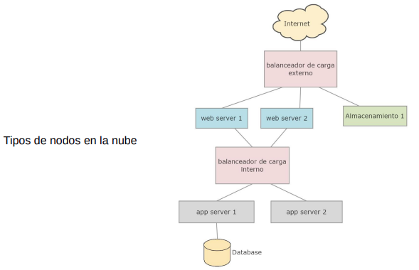

# Introduccion

## Redes de Computadoras (dispositivos)

#### ¿Que tipos de dispositivos queremos interconectar por medio de redes?

Los dispositivos que queremos interconectar por medio de redes reciben el nombre de ***Hosts*** o **Sistemas Finales**, estos son dispositivos de cómputo.

#### ¿Que es una **Red de Computadoras**?

Una **Red de Computadoras** es un conjunto de sistemas finales interconectados.
 ¿Que significa que dos computadoras estan interconectadas? Dos computadoras (o *Hosts*) estan **Interconectadas** si se pueden intercambiar informacion.
 ¿De que manera puede hacerse la interconexion? La conexion puede hacerse por **Medio de Transmisión** como cables de cobre, fibra optica, microondas, etc. El intercambio de informacion entre *hosts* se hace por medio de **Señales** que viajan en los medios de transmisión.

#### ¿Que servicios o usos proporcionan las redes de computadoras?

* **Compartir Recursos**:
  * Recursos de hardware como impresoras, almacenamiento, etc.
  * Informacion como datos, archivos, etc.
* Usarlas como medio de comunicacion entre personas.
* **Socializar**: Como el uso de las redes sociales.
* **Trabajo Colaborativo**: Como la creacion de documentos entre varias personas en distintas localizaciones.
* **Comercio Electronico**
* **Entretenimiento**: como juegos, o distribucion de contenidos de TV por suscripcion (IPTV).

### Tipos de Redes de Computadoras

Existen distintos **Tipos de Redes de Computadoras**. Las redes de computadoras pueden venir en varios tamaños, formas y cumplir distintos propositos.

#### ¿Que hacer para que los *hosts* de varias redes de distinto tipo puedan compunicarse entre si?

Varias redes de computadoras pueden ser Interconectadas entre si para formar redes mas grandes y mas complejas, como por ejemplo el **Internet** es la red de redes mas grande.

* ***Personal Area Network***: Bluetooth.
* ***Local Area Network*** (**LAN**): WiFi.
* ***Metropolitan Area Network*** (**MAN**): 3G, 4G, 5G.
* ***Wide Area Network*** (**WAN**).
* ***The Internet***.

Todos estos tipos de redes, mientras mas chica es la distancia se trabaja con la estrategia de **Difusion** de Informacion, es decir, se envia la informacion a todos los *hosts* de la red. Es util en distancias cortas.
  En distancias mas largas se trabaja con enlaces de **Punto a Punto**. En este caso se envia la informacion a un solo *host* de la red.

### Sistemas Operativos de Red

### Aplicaciones de Red

Como vimos las redes de computadoras se usan para proveer disintos servicios, para proveer estos servicios se crean **Aplicaciones de Red**. Lo que hacen estas aplicaciones es acceder a los servicios de red, ofrecidos por el **SO de Red**, que se encarga de hacer uso de los protocolos. Se usan **APIs y Middlewares** para programarlas.

### Interredes

#### ¿Como comunicamos personas pertenecientes a redes diferentes?

Para comunicar a personas con diferentes tipos de redes, usamos las **Interredes**. La Interred es un conjunto de redes interconectadas.
  **Puerta de Enlace** son el punto o interfaz de una red que permite salir hacia afuera de la red y conectarse con una red cercana o de jerarquia superior. El ejemplo mas claro de una Interred es el **Internet**.

---

## Redes de Area Amplia (WANs) (*Wide Area Networks*)

Una **Red de Area Amplia (WAN)** es una red que cubre un area geografica grande, tipicamente un pais o hasta un contiente.
 Las WANs estan organizadas de la siguiente manera:
* **Subred**: Varios enrutadores conectados entre si que forman un grafo, con un arco se representa un cable que une a 2 enrutadores.

#### ¿Como se hace para enviar mensajes en una WAN?

Con el **Algoritmo de Almacenamiento y Reenvio**, un paquete sigue una ruta de enrutadores, el paquete se almacena enteramente en cada enrutador de la ruta. El paquete almacenado en un enrutador espera alli hasta que la linea requerida de salida este libre y luego se reenvia al siguiente enrutador.

* **Tasa de Transmision**

#### Encolado y Perdidas de Paquetes

Si la tasa de llegada al enlace (en bits) escede a la tasa de transmision del enlace por un periodo de tiempo, los paquetes se van a encolar y esperaran a ser transmitidos en el enlace. Los paquetes puede ser descartados (perdidos) si la memoria (el *buffer*) se llena.

#### Algoritmo de Enrutamiento

En general hay varios caminos que conectan dos enrutadores, el **Algoritmo de Enrutamiento** decide cual de ellos se va a usar.

#### ¿Cuanto demora el almacenamiento y reenvio?

#### Sistema Telefonico Fijo

Cada domicilio esta conectado por un cable de cobre a un **End Office** (Oficina Central). Toda oficina central esta conectada a un **Toll Office**, estas son usadas para reenvio de mensajes y estan unidas por cables de fibra obtica.

---

## Redes de Area Metropolitana (MANs) (*Metropolitan Area Networks*)

Una Red de Area Metropolitana (MAN) es una red que cubre a una ciudad, existen dos tipos de MANs:

#### Redes de Cable 

* Se basan en la red de TV por cable.
* Para unir varias casas se usa un **Cable Coaxial**.

#### Redes Inalambricas (MAN WiMAX)

* Son redes inalambricas de alta velocidad.
* Hay una estacion base que permite enviar paquetes por el aire en lugar de usar cables.
* La estacion base se conecta a internet.
* Se puede acceder a la red WiMAX desde computadoras en casas o edificios.

---

## Redes de Area Local (LANs) (*Local Area Networks*)

Una Red de Area Local (LAN) es una red operada previamente dentro de un edificio o casa, tambien puede operar en un campus de varios edificios.

#### ¿Donde puede usarse una LAN?

Una LAN puede usarse en un hogar o en una organizacion (publica o privada). Las LAN usadas por compañias se les llama **Redes Empresariales**.

#### ¿Que tipos de Host se comunican a una LAN?

Las LAN se usan para comunicar PCs, notebooks, celualres, etc.. La idea es que los *hosts* puedan compartir recursos e intercambiar informacion.

#### Tipos de LAN

* **LAN Inalambricas**: Las maquinas se comunican entre si (si uso de calbes) por medio de una estacion base (*acceso point*).
* **Ethernet**: Las maquinas se conectan por medio de cables a un commutador (*switch*).

#### Difusion de Mensajes

Si enviamos un mensaje a todas las maquinas esto se lo llama ***Broadcasting***. Si lo enviamos a un grupo de maquinas en particular se lo llama ***Multicasting***.

#### Colision

Se envia un mensaje en una red de difusion, pero esto se pierde ¿Porque pasa esto? por las **Colisiones**: Mas de una maquina manda simultaneamente un mensaje, los mensajes colisionan y se dañan.

---

## Internet

La **Internet** es una red de redes que interconectan varias redes entre si, esta formada por billones de dispositivos de computacion conectados entre si. En la internet se ejecutan las **Aplicaciones de Red**. Para el envio y la recepcion de mensajes entre sistemas finales se usan **Protocolos**.

### Estructura de la Internet

Los *Hosts* acceden a la internet a traves de **Proveedores de Servicios de Internet de Acceso** (ISPs de Acceso) (***Internet Service Provider Access***).

#### ¿que tipos de ISP de acceso existe?

* Uso de **ISP Residenciales** (compañias de cables, telefonicas, fibra a la casa, etc.).
* Uso de **ISP Empresarial** (da acceso a sus empleados).
* Uso de **ISPs Universitaria** (da acceso a docentes, estudiantes y personal).
* Celualres (4G, 5G).
* **ISPs que Proveen Acceso a WiFi** (en aeropuertos, hoteles, restaurantes, parques, etc.).

#### ¿Como hacer para que dos *hosts* que estan conectados a diferentes ISPs de acceso puedan enviarse paquetes entre si?

Los ISPs de Acceso deben estar interconectados xd.
 Pero dados miles de ISPs de acceso, ¿Como los conectamos entre si?

* En la figura, la los *access net* son una red diferente.

#### Idea 1: Conectar cada ISP de acceso a todo otro ISP de acceso.

---

#### Idea 2: Conectar cada ISP de acceso a un ISP global de transito

* Cada ISP de Acceso se conecta a un ISP global de transito.

---

#### Idea 3: Es mas conveniente tener ISPs globales de transito que conectan los ISPs de Acceso

Las ISP de acceso son interconectadas a traves de redes ISP nacionales e internacionales de mas alto nivel llamados **ISPs de Capa Superior** o **Globales de Transito**, consiste de enrutadores de alta velocidad interconectados con enlaces de fibra optica de alta velocidad. Estas son ISP que proveen **Servicios de Transito**.

#### ¿Que Conclusiones podemos sacar sobre el diagrama anterior?

Las ISP globales de transito deben estar interconectadas entre si y cada red ISP, ya sea de acceso o de capa superior, es manejada independientemente.

Los ISP globales de transito NO tienen presencia en cada ciudad o region del mundo ¿Y esto que implica? Esto hace que algunas ISP de acceso no se puedan conectar directamente con los ISP globales. La solucion: En una region puede haber un **ISP Regional** al cual se conectan los ISP de acceso en la region.

#### ¿Cuales son las consecuencias de la solucion anterior?

* Cada ISP regional se conecta con ISPs globales de transito.
* Los ISPs de acceso pagan al ISP regional al cual se conectan, y cada ISP regional paga al ISP global de transito al cual se conecta.
* En algunos lugares un ISP regional puede cubrir un pais entero y ese ISP regional se conectan otros ISP regionales.

Por ultimo tenemos las redes proovedoras de contenido (como Google, Facebook, Microsoft, etc.). Estas pueden ejecturae su propia red, para traer servicios, y contenido cerca de los usuarios.

#### ¿Porque se usan estas redes?

Se usan para reducir pagos a redes de transito global y para tener control sobre como sus servicios son entregaods a los usuarios.

#### ¿A que redes se conectan las redes proveedoras de contenido?

Se conectan a ISP regionales e ISP de acceso. Podrian llegar a usar un ISP de transito si no le queda otra.

#### Jerarquias

Si pensamos a la internet como una red formada por niveles que forman una jerarquia, tendriamos la siguiente jerarquia:

* "*Tier-1*" **ISPs Comerciales** (redes globales de transito) no tienen una cobertura nacional e internacional.
* **Redes Proovedoras de Contenido**.
* En el medio ISP regionales.
* Y al ultimo las ISPs de Acceso.

---

## Internet de las Cosas (IoT) (*Internet of Things*)

La **Internet de las Cosas** (**IoT**) es un sistema interconectado que permite que a los dispositivos fisicos, conocidos como **Dispositivos IoT** se conecten a internet y compartan datos entre si y con sistemas en la nube.
 Algunos ejemplos de dispositivos IoT son: 
* **Sensores**: Miden variables fisicas o quimicas.
* **Actuadores**: Ejecutan acciones fisicas basadas en señales electricas.
* **Wearables**: Dispositivos portatiles que monitorean la salud y actividad fisica.

#### ¿Cual es el Proposito de la IoT?

El proposito de la IoT es crear una red de objetos conectados que recopilen, comparten y actuen con informacion para mejorar la vida cotidiana y la eficiencia en diferentes conextos.

#### Metas de la IoT

* **Automatizacion**: Realizar tareas automaticamente sin intervencion humana.
* **Monitoreo**: Proporcionar datos en tiempo real sobre condiciones especificas.
* **Optimizacion de Recursos** como la energia, agua, tiempo, etc.
* **Mejora de la Vida Cotidiana**.
* **Sostenibilidad Ambiental**: Reducir emisiones y ruido.
* **Analisis de Datos** para  tomar decisiones informadas.
* **Mejorar la Seguridad Fisica**: Deteccion de instrusiones, de fallos importantes y actuar rapidamente.

### Estructura de la IoT

Las redes IoT se pueden clasificar por diferentes criterios:

#### Por Tipo de Conectividad

* **Redes de Celulares**: Estas redes usan tegnologias como 4G y 5G para proporcionar alta velocidad y cobertura amplia, ideales para aplicaciones que requieran gran ancho de banda y baja latencia.
* **Redes de Medio Alcance** (como el WiFi).
* **Redes de Corto Alcance**: Estas redes incluyen tegnologias para entorno pequeños como hogares y oficinas, tienen un alcance limitado, pero son eficientes en consumo de energia (Bluetooth, zigbee).
* **Redes de Area Amplica de Baja Latencia** (**LPWAN**) (*Low Power Wide Area Network*): Estas redes estan diseñadass para dispositivos que requieren largas distancias de comunicacion con bajo consumo de energia.

#### Por Consumo Energetico

* **Bajo Consumo**: Redes que priorizan la eficiencia energetica.
* **Muy Bajo Consumo**.
* **Alto Consumo**: Redes que pueden soportar dispositivos con mayor demanda energetica. Suelen usar WiFi o redes de celulares.

#### Por Proposito o Aplicacion

* **Redes de Salud**: Se usan en aplicaciones de telemedicina y monitoreo de pacientes, permitiendo la recopilacion y transmision de datos de datos medicos en tiempo real.
* **Redes Industriales**: Diseñadas para el monitoreo y control de maquinaria en fabricas.
* **Redes de Agricultura Inteligente**: Integran dispositivos domesticos conectados.
* **Redes para Ciudades Inteligentes**: Usadas para gestionar servicios urbanos. Suelen ser sensores para recolectar datos.
* **Redes de Transpoerte y Logistica**: Se usan para optimizar el transporte y la gestion de la cadena de suministro.
* **Redes IoT de Retail**: Se usan para mejorar la experiencia del cliente y la eficiencia operativa en el comercio minorista.

Las redes clasificas segun su proposito o aplicacion pueden ser Redes de Sensores o Sistemas Ciberfisicos (CPS) (Cyber-Physical Systems).

#### Redes IoT de Sensores

Una red Iot de Sensores generalmente incluye diversos dispositivos de monitoreo y comunicacion diseñados para recopilar, procesa y transmitir datos, suele incluir distintoss tipos de dispositivos:
* **Sensores**.
* **Gateways IoT**: Dispositivos que actuan como intermediarios entre sensores y la nube, recopilando y transmitiendo datos.
* **Servidores en la Nube**: Almacenamiento y procesamiento de datos, analisis y ejecucion de algoritmos.
* **Dispositivos de Usuario** (celulares, tablets, computadoras, etc.): Usadas para monitorear y controlar la red de sensores.

#### Conectores Entre Dispositivos

* **Sensores a Gateways IoT**: Conectados mediante redes inalambricas de corto o medio alcance, o redes de baja potencia y largo alcance.
* **Gateways IoT a Servidores en la Nube**: Conectados a traves de internet.
* **Servidores en la Nube a Dispositivos de Usuario**: Conectados a traves de internet, permitiendo el acceso remoto a los datos desde cualquier lugar.

#### Sistemas CPS (*Cyber-Physical Systems*)

Los sistemas CPS son sistemas que integran componentes fisicos y computacionales. Estos sistemas estan diseñados para interactuar con el mundo fisico a traves de sensores y actuadores, y estan controlados por algoritmos.
 Algunos Dispositivos CPS son:
* **Sensores**.
* **Actuadores**: Dispositivos que realizan acciones basadas en los datos.
* **Controladores**: Dispositivos que procesan los datos de los sensores y envian comandos a los actuadores. Este dispositivo actua como el cerebro del sistema.
* **Servidores en la Nube**.
* **Dispositivos de Usuario**.

#### Conectores Entre Dispositivos

* **Sensores a Actuadores**: Coneccion por cable o inalambrica.
* **Actuadores a Controladores**: Conexion por cables o inalambrica.
* **Controladores a Servidores en la Nube**: conexion por Ethernet o redes de celulares.
* **Conexion entre Servidores en la Nube y Dispositivos de Usuario**: Conectados a traves de internet.

#### Funciones de un Controlador

* **Recopilacion y Procesamiento de Datos**.
* **Control y Ejecucion de Acciones**.
* **Monitoreo y Supervision**: Mantiene un monitoreo constante del estado de los dispositivos conectados.
* **Comunicacion y Coordinacion**: Facilita la comunicacion entre diferentes dispositivos y sistemas en la red, actuando como intermediario para la transmision de datos.
* **Gestion de Alarmas y Eventos**: Detecta condiciones anomalas o situaciones de fallo y genera alarmas para notificar al personal de mantenimiento o alos sistemas de supervision.
* **Retroalimantacion a Gateways y Sistemas en la Nube**: Transmite datos recopilados y procesados a los servidores en la nube para analisis adicional y almacenamiento, sincroniza datos con otros sistemas de control y monitoreo.

---

## La Nube

La Nube permite el acceso remoto a un conjunto de recursos informaticos (almacenamiento, procesamiento de datos, aplicaciones, etc.) a traves de una **Red de Servidores** interconectados. Estos servidores utilizan protocolos para comunicarse entre si y con los usuarios, lo que facilita la entrega eficiente y escalable de servicios. Los recursos se asignan y usan dinamicamente segun las necesidades cambiantes de los servicios ofrecidos, permitiendo a las organizaciones optimizar su infraestructura tegnologica sin necesidad de gestionar fisicamente el hardware.

#### Clasificacion de las Nubes

* **Nuble Publica**: Infraestructura compartida proporcionada por proveedores. Los recursos son compartidos entre multiples usuarios.
* **Nube Privada**: Infraestructura dedicada a una sola organizacion, proporcionando mayor control y seguridad.
* **Nube Hibrida**: Combina aspectos de ambas nube, permitiendo a las organizaciones aprovechar lo mejor de ambos mundos.

### Estructura de la Nube

Una nube se la puede considerar como una red jerarquica compuesta por 4 niveles:
1. **Regiones**: Son ubicaciones geograficas donde los proveedores de servicios en la nube tienen centro de datos, cada regioon puede albergar multiples zonas de disponibilidad.
2. **Zona de Disponibilidad**: Son Centros de Datos Aislados dentro de una region que estan diseñados para operar independientemente, esto proporciona redundancia y alta disponibilidad, ya que si una zona falla, las aplicaciones pueden seguir funcionando en otra.
3. **Nube Privada Virtual** (**VPC**) (***Virtual Private Cloud***): Es una red virtual logicamente aislada dentro de una nube publica que permite a los usuarios definir su propio enterno de red. Dentro de una VPC se pueden crear subredes publicas y privadas, lo que permite un control granular sobre el acceso a los recursos.
4. **Subredes**: Son divisiones dentro de una VPC que permiten organizar y aislar recursos, pueden ser publicas (con acceso a internet) o privadas (sin acceso directo a internet). Esto facilita la gestion del trafico y la seguridad.

#### Tipos de nodos en una nube:

* **Servidores Web**: Manejan las solicitudes HTTP/HTTPS y sirven contenido web.
* **Servidores de Aplicaciones**: Procesan la logica de la aplicacion y acceden a la base de datos.
* **Servidores de Bases de Datos**: Manejan las bases de datos.
* **Almacenamiento de Objetos**: Utilizados para almacenar archivos estaticos.
* **Balanceadores de Carga**: Distribuyen el trafico entre multiples servidores para optimizar el uso de los recursos y mejorar la disponibilidad, esto es esencial para manejar picos de trafico y garantizar tiempos de respuesta.

#### Clasificacion de los balanceadores de carga:

* **Balanceadores de Carga Externo**: Se usa para distribuir trafico de clientes externos hacia los servidores web (los usuarios externos envian solicitudes al balanceador de carga).
* **Balanceador de Carga Interno**: Se usa para distribuir el trafico entre servidores internos, como entre servidores web y servidores de aplicaciones o bases de datos, sin exponer estos recursos al publico. Solo esta accesible desde una VPC.

#### Tipos de Enrutadores en la nube:

* **Enrutador de la VPC**: Se encarga de de la comunicacion entre las subredes dentro de la misma VPC y de dirigir el trafico hascia y desde internet (a traves de la puerta de enlace de internet) o hacia otras VPCs (a traves de puerta de enlace de VPC). Los servidores en diferentes subredes dentro de la misma VPC se comunican a traves del enrutador de la VPC. Cuando un servidor en una subred publica necesita comunicarse con internet, el enrutador de la VPC dirige el trafico hacia la puerta de enlace de internet. Si necesitas que dos VPC se comuniquen entre si, usamos una puerta de enlace de VPC xd.
* **Puerta de Enlace de Internet**: Se conecta a la internet y permite que los servidores en la subredes publicas envien y reciban trafico de internet.
* **Puerta de Enlace de VPC**: Se usan para comunicar diferentes VPCs entre si.

---

## Redes Blockchain

una Red Blockchain es un conjunto de nodos interconectados que operan en un **Sistema Centralizado** que permite la creacion de un registro digital de transacciones descentralizado y seguro. Las transacciones se agrupan en Bloques que se encadenan unos con otros, estas cadenas son accesibles t verificables por participantes de la red.

#### ¿Que permite una red blockchain?

Una red blockchain permite la validacion del registro de transacciones, usando mecanismos de consenso para asegurar la integridad y seguridad de los datos. Puede proporcionar funcionalidades avanzadas como **Contratos Inteligentes** que automatizan procesos mediante condiciones predefinidas.

#### Tipos de Dispositivos en una red blockchain:

* **Nodos Completos**: Tienen copias del registro (tambien llamado **Libro Mayor**) y participan en la validacion de transacciones, tambien pueden ejecutra contratos inteligentes.
* **Dispositivos Mineros**: Se usan para validar transacciones y crear nuevos bloques una vez que resolvieron un problema matematico complejo. Si la blockchain no tiene nodos mineros, los nodos completos pueden cumplir el rol de crear y agregar nuevos bloques a la blackchain pero usando otro mecanismo distinto.
* **Nodos Ligeros**: Pueden verificar y procesar transacciones, solicitan datos a los nodos completos para sus operaciones.
* **Billeteras Digitales**: Son aplicaciones o dispositivos fisicos que permiten a los usuarios almacenar, enviar y recibir criptomonedas, interactuando con la red blockchain.

#### Objetivos de las redes blockchain

* **Transparencia**: Permitir a los usuarios verificar las transacciones en tiempo real, aumentando la confianza entre las partes involucradas.
* **Inmutabilidad**: Garantizar que una vez que los datos son registrados, no puedan ser alterados ni eliminados sin el consenso de la red.
* **Descentralizacion**: Eliminar la dependencia de un unico punto de control, lo que reduce el riesgo de fraude y mejora la resiliencia del sistema.
* **Interoperabilidad**: Facilitar la comunicacion y el intercambio de datos entre diferentes blockchains, creando asi un ecosistema mas integrado.

#### Integracion con las tegnologias anteriores

* **Internet**: Proporciona la infraestructura necesaria para la comunicacion entre nodos distribuidos. La blockchain opera sobre internet, utilizando sus protocolos para transmitir datos y permitir el acceso global.
* **Nube**: Aunque la blockchain puede funcionar independientemente, a menudo se integra con servicios en la nube para almacenamiento adicional y procesamiento, mejorando su escabilidad y flexibilidad.
* **Base de Datos**: A diferencia de las bases de datos tradicionales, las blockchains actua como una base de datos distribuida donde hay nodos que mantienen una copia del registro, lo que mejora la seguridad y transparencia.

### Estructura de las Redes Blockchain

#### Caracteristicas estructurales de la blockchain

* **Estructura Descentralizada**: No hay un nodo central que controle la red; hay varios nodos con copias del libro mayor que participan en procesos de validacion de transacciones.
* **Uso de Modelo P2P**: Cada nodo se conecta directamente a otros nodos sin intermediarios; hay una comunicacion directa y eficiente entre los participantes.
* **Consenso Distribuido**: La red usa mecanismos de consenso para validar transacciones y mantener la integridad del libro mayor.. Todos los nodos deben llegar a un acuerdo sobre el estado de la blockchain antes de agregar nuevos bloques.

#### Tipos de nodos en la blockchain

En la red blockchain hay nodos de distitntos tipos que cumplen con un conjunto de roles cada uno. Una red blockchain particular solo va a tener un susbconjunto de los tipos de nodos que existen y no todos.

