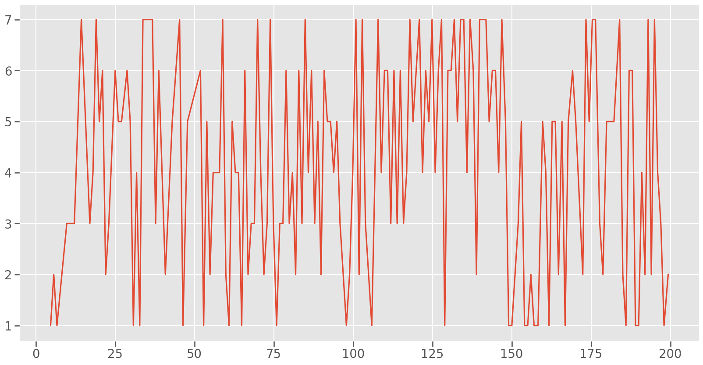

# Algoritmo de Enrutamiento

**Integrantes**:

* Farias, Santos Facundo Adrian.

* Irrazabal, Luca Alfredo.

* Michel, Brandon Blas.

* Ponchiardi, Santino.

## Resumen

En este trabajo se implementó y evaluó un algoritmo de enrutamiento mejorado para una red en anillo de 8 Nodos. El objetivo principal fue mejorar el algoritmo básico proporcionado en el kickstarter, el cual siempre enviaba los paquetes en sentido horario sin considerar posibles rutas más eficientes.

Se desarrolló un mecanismo de feedback que permite a cada Nodo conocer las distancias hacia todos los demás Nodos a través de ambos sentidos del anillo (izquierda y derecha). Con esta información, los Nodos pueden tomar decisiones de enrutamiento óptimas, seleccionando siempre el camino con menor cantidad de saltos hacia el destino.

El algoritmo fue evaluado en dos escenarios distintos (Caso 1 y Caso 2), mostrando mejoras significativas en el uso de los recursos de red, especialmente en la distribución de la carga entre los `buffers` de los Nodos y en la reducción del **Delay** promedio de los paquetes.

---
## Introduccion

Las redes en anillo son topologías comunes en sistemas distribuidos, donde la eficiencia del enrutamiento es crucial para el desempeño general. El problema fundamental nace en decidir por qué `link` enviar cada paquete cuando existen múltiples caminos posibles hacia el destino.

El kickstarter proporcionado implementaba una estrategia simple, enviando todos los paquetes en sentido horario (hacia la derecha), lo que generaba desbalanceos en la carga de la red y saturación de ciertos nodos. Este proyecto propone una solución basada en el intercambio de información de distancia entre Nodos, permitiendo decisiones de enrutamiento más inteligentes.

La implementación se centró en la capa `Net`, donde se modificó el manejo de mensajes para incluir paquetes de `feedback` que recorren la red en ambos sentidos, recolectando información sobre las distancias entre nodos. Cada nodo mantiene dos matrices de distancias (una para cada sentido del anillo) y utiliza esta información para calcular la ruta óptima hacia cualquier destino.

---
## Tarea de Analisis

### Experimentos y Preguntas

#### Caso 1 (Nodos 0 y 2 transmitiendo datos al Nodo 5)

    - ¿Que metricas se obtienen?

Las metricas que nosotros utilizamos para este analisis fueron varias:

* El **Buffersize** que mide como se van llenando las colas de cada nodo. 

* El **Delay** de los paquetes que iban llegando al App.

* El **packetIn** y el **packetOut** que registran cuando un paquete entra o sale de alguna cola. 

* Por ultimo implementamos una metrica **hopcount** para medir la cantidad de saltos que realiza en total cada paquete hasta llegar a destino.

    - ¿Como es el uso de los recursos de la red?¿Se puede mejorar?

A partir de estas metricas podemos observar que dados nuestros `interArrivalTime` y velocidad de envio de paquetes, se termina ocupando cada vez mas capacidad de la cola del Nodo 0, aumentando de forma constante ya que los `lnk` de este Nodo deben manejar tanto los paquetes que se crean en el mismo Nodo como los que le llegan desde el Nodo 2, por lo mismo, la cola del Nodo 2 no se termina llenando demasiado, aca podemos concluir que se esta saturando demasiado el Nodo 0 por lo que podriamos mejorar el rendimiento del algoritmo para que no se sature tanto el `buffer` de dicho Nodo.

Consecuentemente, esto afecta nuestra metrica del **Delay**, ya que los paquetes tardan cada vez mas en llegar a destino debido a que se llena el `buffer` del Nodo 0, por lo que esta es otra evidencia de que nuestro algoritmo definitivamente se puede mejorar para que el **Delay** no termine aumentando indefinidamente.

Por ultimo nuestras metricas de **hopCount**, **packetIn** y **packetOut** no terminan diciendonos demasiado acerca de nuestro algorimo, **packetIn** y **packetOut** registran un 1 por cada paquete que sale o entra al nodo, por lo que la grafica es simplemente una linea recta horizontal en `y=1`. **hopCount** en cambio, varia los valores entre 5 y 3, ya que los paquetes se generan en los Nodos 0 y 2 por lo que siempre se van a realizar 5 a 3 saltos, lo que no nos dice particularmente nada del algoritmo por ahora.

#### Caso 2 (Todos los Nodos generan trafico hacia el Nodo 5)

Vemos que si el `interArrivalTime` se queda como `exponential(1)`, los `buffers` de casi todos los Nodos se van a terminar llenando menos la del Nodo 4 ya que este al siempre enviarse los paquetes en sentido del reloj, este Nodo solo debe manejar sus propios paquetes, pero quitando esta excepcion, todos los Nodos terminan con la cola saturada de paquetes.

Esto tambien afecta el **Delay**, el cual ahora tiene un comportamiento mas erratico pero aumentando considerablemente la tardanza en la llegada de los paquetes a destino.

El **hopCount** tiene el comportamiento esperado, variando en numeros desde 1 a 7, mientras que **packetIn** y **packetOut** siguen registrando simplemente 1's por lo que no hay un cambio significativo por ese lado.

##### Notamos que

* Sin el algoritmo implementado:

    - Con un `exponential(t)` entre $7 <= t <= 7.5$, se logra ver que las colas no aumentan el tamaño, sino que se quedan con maximo de 10 paquetes por un breve momento.

* Con el algoritmo implementado:

    - Si el `inteArrivalTime=exponential(1)`, las colas se llenan, hasta aproximadamente, con mas de 200 paquetes.
    
    - Si el `interArrivalTime=exponential(3)`, se ve como va disminuyendo el tamaño de las colas, pero todavia sigue aumentando con el tiempo.

    - Ya en `interArrivalTime=exponential(5)`, se alcanza en un momento su maximo de 9 paquetes, para despues disminuir. Por lo que es el mejor `interArrivalTime` sin que perjudique el procesamiento de paquetes y, al mismo tiempo, se puede garantizar un equilibrio/estabilidad en la red.

    - Por lo que creemos que el mejor `InterArrivalTime` seria uno cercano a `exponential(5)`, para que la cantidad de paquetes atascados sea minima, pero al mismo tiempo, los paquetes no se procesen cada mucho tiempo. Osea un equilibrio entre generacion de paquetes y colas sin llenarse.

---
## Metodo

### Implementacion del Algoritmo de Enrutamiento

El algoritmo de enrutamiento se implemento en la capa `Net` de cada Nodo y tiene tres caracteristicas claves en su Implementacion:

* **Paquete de FeedBack**:

    - Cada nodo genera dos paquetes especiales (`FeedbackPkt`) al inicializar la simulación:

        * Uno enviado por el enlace a la derecha (`lnk[0]`).

        * Otro enviado por el enlace a la izquierda (`lnk[0]`).

    - Estos paquetes recorren la red en ambos sentidos, recolectando información sobre la distancia (en saltos) desde el Nodo origen hasta cada Nodo que visitan.

* **Arreglos de Distancias**:

    - Cada nodo mantiene dos arreglos:

        * `distanciasDerecha`: Distancias mínimas a otros nodos a través del sentido horario (derecha).

        * `distanciasIzquierda`: Distancias mínimas a través del sentido antihorario (izquierda).

* **Tomas de Decisiones**:

    - Cuando un `Packet` llega a un Nodo que no es su destino, el algoritmo:

        1. Consulta el arreglo `preferedDoor`, que almacena la dirección óptima (0: derecha, 1: izquierda) para cada nodo destino.
        2. Reenvía el paquete por el enlace que ofrece el camino con menos saltos hacia el destino.

    - El array `preferedDoor` se calcula comparando las distancias en ambos sentidos (`preferedDoor[i] = (distanciasDerecha[i] < distanciasIzquierda[i])`).

---
## Resultados

### Buffersize

#### Caso 1

* Sin el algoritmo implementado:

Notamos que se llena el `buffer` del Nodo 0 mas que los demas, ya que se generan mas paquetes de lo que el Nodo puede mandar. 

Nosotros teniamos la hipotesis que el Nodo 6 iba a ser el que se le llenaria mas el `buffer`, ya que pensabamos que por estar al lado del nodo donde se enviaban todos los paquetes, se le llenaria antes la cola. Pero, en cambio, el Nodo 6 solamente recibe los paquetes e inmediatamente lo envia al Nodo 5.

* Con el algoritmo implementado:

Notamos que con el algoritmo implementado, esta metrica mejora. Ya que el maximo de paquetes que ocupa en el `buffer` (en este caso el Nodo 0) seria de 9 paquetes. En comparacion con la grafica sin el algoritmo implementado, el numero de paquetes que se va acumulando en la cola, crece exponencialmente.

#### Caso 2

* Sin el Algoritmo implementado:

* Con el Algoritmo implementado:

* Conclusion: Vemos en las graficas como, con la implementacion del algoritmo, se nota una mejoria en como se llenan los `buffers`, reduciendo notoriamente la congestion en los mismos.

### Delay

#### Caso 1

* Sin el Algoritmo implementado:

* Con el Algoritmo implementado:

* Conclusion: Vemos que el delay sin el algoritmo implementado crece exponencialmente, esto sucede porque todos los paquetes estan forzados a seguir la misma ruta. El `buffer` del Nodo 0 se satura (como vimos en las graficas del bufferSize), esto genera delay, ya que cada paquete tiene que espera mas tiempo en la cola hasta poder ser enviado. En cambio, con el algoritmo implementado, el maximo de delay es un poco mas 12, por lo que podemos decir que el algoritmo mejora el delay de forma considerable, ya que al tomar rutas mas optimas, disminuye la congestion en los Nodos, por lo tanto hay menos delay.

#### Caso 2

* Sin el Algoritmo implementado:

* Con el Algoritmo implementado:

* Conclusion: Vemos que apenas hay cambios en la grafica, pero se ve una mejoria en los valores con el algoritmo. Ya que, el pico maximo es de 12 en comparacion con la grafica sin el algoritmo implementado, que es de 14.

### HopCount

#### Caso 1

* Sin el algoritmo implementado:

* Con el algoritmo implementado:

* Conclusion: Vemos que sin implementar el algoritmo, los paquetes hacen entre 3 y 5 saltos para llegar al nodo receptor. En cambio con el algoritmo, siempre es 3 porque los nodos generadores (0 y 2) van a elegir la ruta mas optima, que justamente hacen 3 saltos los dos.

#### Caso 2

* Sin el algoritmo implementado:

* Con el algoritmo implementado:

* Conclusion: Notamos que hay una mejoria. Al no tener el algoritmo, los paquetes deben hacer un maximo de 7 saltos. En cambio con el algoritmo implementado, la cantidad maxima de saltos se reduce a 4. Lo que nos indica que el algoritmo funciona y efectivamente toma la ruta mas optima.

---
## Bonus Track

### Software-Defined Networking (*SDN*)

* **¿Que es?**

SDN es un enfoque de redes que utiliza controladores de software que pueden ser impulsados por APIs para comunicarse con la infraestructura de hardware para dirigir el tráfico de red.

Mediante el uso del software, SDN crea y opera una serie de redes de superposición virtual que funcionan conjuntamente con una red subyacente física. Las SDN proporcionan el potencial de ofrecer entornos de aplicación como código y minimizar el tiempo práctico necesario para administrar la red.

* **Hoy en dia**: las empresas utilizan SDN porque es una forma que permite controlar el tráfico de manera eficiente y escalar según sea necesario.

Las empresas utilizan SDN para aplicar los beneficios de la nube a la implementación y la administración de redes. Con la virtualización de las redes, las organizaciones pueden abrir la puerta a una mayor eficiencia mediante nuevas herramientas y tecnologías, como el software como servicio (SaaS), la infraestructura como servicio (IaaS) y otros servicios de computación en la nube, así como integrarse mediante API con su red definida por software.

SDN también aumenta la visibilidad y la flexibilidad. En un entorno tradicional, un enrutador o conmutador, ya sea en la nube o físicamente en el centro de datos, solo conoce el estado de los dispositivos de red adyacentes. SDN centraliza esta información para que las organizaciones puedan ver y controlar toda la red y los dispositivos. Las organizaciones también pueden segmentar diferentes redes virtuales dentro de una misma red física o conectar diferentes redes físicas para crear una única red virtual, lo que ofrece un alto grado de flexibilidad.

# Punto estrella

Se realizó el punto estrella de una forma probablemente ineficiente, solamente reestructurando la idea obtenida del ejercicio base.

El algoritmo necesita aproximadamente 46k iteraciones (eventos), el equivalente a enviar aproximadamente 5k paquetes con información de enrutamiento, antes de empezar a realizar envíos de paquetes.

¿Por qué tan ineficiente?  
Debido a que no se implementó Dijkstra ni se utilizan nodos como “routers” ni se envían resúmenes de área, todos los nodos tienen que aprender a llegar a cualquier otro nodo de forma “rápida”. El problema es que la mejor ruta está siendo comparada aproximadamente 3025 veces (Una por cada nodo que reenvía la información cada vez que le llega un paquete que no vió + el reenvío producido porque se hayó una mejor ruta).

# Idea

En lugar de que metaforicamente cada nodo piense “¿Cúanto me cuesta llegar a otros?, cambiarlo por "¿Cuánto le cuesta a otros llegar a mí?".
# Implementación
Se envía un feedbackPacket por cada puerta que tengan los nodos.

Al llegar a otro nodo, este guarda su información en un diccionario de la forma:  
<nodo, (puertaPreferida, costo)>
# Testeo
No se entregan gráficas por problemas con omnet, debido a que la mayoría de problemas fueron corregidos a última hora por la persona que no puede generar estos gráficos/tablas.
Por este motivo, se indica la manera de testear visualmente con omnet.
(Se pueden encontrar los archivos necesarios para la compilación en el branch algoritmo_v3.)
1. Compilar y ejecutar
2. Saltear hasta el evento N°45.000 (Utilizando la herramienta >| de la interfaz de omnet)
3. Reproducir normalmente.
Despueś de realizar esto, se podrá observar cómo fluyen feedbackpackets entre todos los nodos de la red. Al llegar al evento 46.000, se verá cómo los paquetes empiezan a fluir por todos los nodos, enviando paquetes hacia los N° 5 y 36. 
# Problemas

Acá hay algunos de los infinitos problemas que se tuvieron durante la implementación del algoritmo de este punto estrella.

Quizás puedan ser útiles para alguien que lo intente realizar en un futuro.

# 1ro: Enlace exterior no existente

Todos los nodos tienen 4 puertas que salen de él, pero no todas están conectadas.

Solución: verificar si la puerta del padre está conectada al exterior en esa posición.

# 2do: Entrada en diccionario creada por accidente

- Evaluar if (routingTable[node].second > hopCount)  
No es lo mismo que:  
if (it->second.first)  
Debido a que el primero inserta un elemento en el diccionario en caso de no estar definido en la posición “node”, lo que rompía el programa ya que al crear una clave sin asignar un valor, en dicho valor quedaban alojados residuos previos.

# 3ro: index != id

Se estuvo usando por mucho tiempo, para verificar por qué puerta mandar un paquete msg->getArrivalGate()->getId();  
donde los id’s tenían números enormes (Quizás eran direcciones de memoria).

La solución fue utilizar el método correcto: getIndex();

# 4to: Criterio de eliminación de feedbacks

Esta fue posiblemente la parte más complicada.

Primer criterio: ¿Elimino un paquete o lo reenvío?

Criterio: Eliminar cuando:

El paquete ya fue visto y la información ofrecida (hops) es peor que la que ya se tenía.

¿Por qué?  
Si la información ofrecida es peor, quiere decir que este nodo ya re-envió un paquete ofreciendo una mejor ruta para llegar al nodo del que está trayendo dicha información. Por lo tanto, antes de que todo el resto de nodos también tenga que leer e ignorar este paquete, directamente eliminarlo.

En todo caso, si no se lo elimina, ese paquete va a estar constantemente dando vueltas.

# 5to: Motivo de incompletitud
Por algún motivo, al intentar que nodos cercanos al 50 envíen paquetes, estos ignoran la instrucción.
Al seguir avanzando e intentando que los nodos envíen paquetes a nodos de manera aleatoria, ocurren problemas con los ids de las puertas.
No se pudo encontrar el motivo del fallo y, por problemas temporales, se decidió entregar el proyecto tal como está.
# ChatGPT talk

En inglés.

Questions and answers: (Abstract)

- I have this generalizing idea. Can I even code it? Could you help me with this concept?
    
    - Yes! This could be made like this and this and backtracking, also think about this and backtracking.
        
- Does this omnet++ function work as I’m using it? (arrivedOn function)
    
    - Yes, but you typed a type instead of variable name inside that for loop.
        
- I’m not used to work with maps and pairs. Is this ok?
    
    - Almost there! Fix this and include this “auto” variable here.
        
- I don’t understand anything of that “auto” and weird implementations, could you explain them?
    
    - No
        
- Thanks!